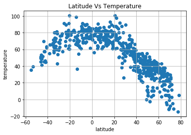
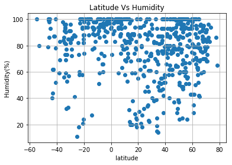
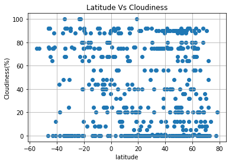
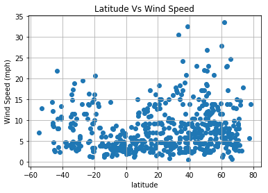

```python
#import dependencies
import pandas as pd
import numpy as np
import matplotlib.pyplot as plt
import requests as req
from citipy import citipy #need to pip install citypy
```


```python
#api keys from openweathermap
api_key = "REMOVED FROM FILE"
url = "http://api.openweathermap.org/data/2.5/weather?"
units = "imperial"

#query url with partial strings
query_url = url + "appid=" + api_key + "&units=" + units + "&q="
```


```python
#list of cities from random coordinates
cities  = []
lat_rand = np.random.uniform(-90, 90,1500) 
lng_rand = np.random.uniform(-180, 180, 1500)
for i in range(len(lat_rand)):
        name = citipy.nearest_city(lat_rand[i], lng_rand[i])
        cities.append(name.city_name)
len(np.unique(cities)) 
```


    611


```python
#Create a list of unique cities
unique_cities = np.unique(cities).tolist()
unique_cities
```


    ['abalak',
     'abu kamal',
     'acapulco',
     'acarau',
     'adamovka',
     'adrar',
     'adre',
     'ahipara',
     'ahome',
     'airai',
     'aklavik',
     'aksay',
     'aksu',
     'aktash',
     'aktau',
     'akyab',
     'albany',
     'aleksandrov gay',
     'alekseyevsk',
     'alice springs',
     'almeirim',
     'alofi',
     'altay',
     'aluksne',
     'amderma',
     'anadyr',
     'anapskaya',
     'ancud',
     'anloga',
     'aranos',
     'araouane',
     'arlit',
     'armacao dos buzios',
     'arraial do cabo',
     'asau',
     'ashqelon',
     'astoria',
     'aswan',
     'atambua',
     'attawapiskat',
     'atuona',
     'avarua',
     'avdiyivka',
     'awbari',
     'ayan',
     'badou',
     'bagado',
     'baghdad',
     'baherden',
     'bairiki',
     'balkhash',
     'bambous virieux',
     'bandarbeyla',
     'banjar',
     'baoshan',
     'barcelos',
     'barentsburg',
     'barrow',
     'batagay-alyta',
     'batemans bay',
     'bathsheba',
     'bay roberts',
     'beidao',
     'beira',
     'belaya gora',
     'bell ville',
     'belmonte',
     'belushya guba',
     'bengkulu',
     'berdigestyakh',
     'beringovskiy',
     'berlevag',
     'bestobe',
     'bethel',
     'bettiah',
     'bilibino',
     'bilma',
     'biltine',
     'birobidzhan',
     'bluff',
     'boa vista',
     'bodden town',
     'boende',
     'boma',
     'bonavista',
     'bongandanga',
     'borogontsy',
     'bosaso',
     'bouca',
     'bowen',
     'brae',
     'bredasdorp',
     'broken hill',
     'broome',
     'bubaque',
     'bud',
     'buin',
     'bumba',
     'buraydah',
     'burnie',
     'busselton',
     'butaritari',
     'cabo san lucas',
     'cagliliog',
     'calvinia',
     'campbell river',
     'caohai',
     'cape town',
     'caravelas',
     'carbonia',
     'carnarvon',
     'carutapera',
     'castro',
     'ceres',
     'chagda',
     'chardara',
     'charters towers',
     'cherskiy',
     'chhindwara',
     'chifeng',
     'chikoy',
     'chokurdakh',
     'chowchilla',
     'christchurch',
     'chumikan',
     'chuy',
     'cidreira',
     'cilegon',
     'cintalapa',
     'ciudad bolivar',
     'clyde river',
     'cockburn town',
     'codrington',
     'coihaique',
     'college',
     'constitucion',
     'coquimbo',
     'coulihaut',
     'creel',
     'culpeper',
     'dakar',
     'dalby',
     'darnah',
     'daura',
     'dayong',
     'deputatskiy',
     'dieppe bay',
     'dikson',
     'dingle',
     'dong hoi',
     'dubti',
     'dunedin',
     'east london',
     'el vigia',
     'emba',
     'emerald',
     'erzin',
     'esil',
     'esperance',
     'essau',
     'esso',
     'ewa beach',
     'faanui',
     'fairbanks',
     'falealupo',
     'fare',
     'faya',
     'flin flon',
     'formoso do araguaia',
     'fort nelson',
     'fortuna',
     'fremont',
     'fulacunda',
     'gamba',
     'gari',
     'gat',
     'gbarnga',
     'gboko',
     'georgetown',
     'geraldton',
     'gigmoto',
     'goma',
     'gornopravdinsk',
     'gorontalo',
     'grand gaube',
     'grand river south east',
     'gravdal',
     'grindavik',
     'guerrero negro',
     'guymon',
     'hailar',
     'hailey',
     'haines junction',
     'halalo',
     'hambantota',
     'hami',
     'hamilton',
     'hammerfest',
     'hasaki',
     'hauterive',
     'havoysund',
     'hearst',
     'hermanus',
     'hilo',
     'hisor',
     'hit',
     'hithadhoo',
     'hobart',
     'hobyo',
     'hofn',
     'honiara',
     'hualmay',
     'huanren',
     'huarmey',
     'husavik',
     'hvammstangi',
     'idah',
     'igarka',
     'ilebo',
     'ilek',
     'illoqqortoormiut',
     'ilulissat',
     'innisfail',
     'inongo',
     'inverbervie',
     'iqaluit',
     'isangel',
     'isiro',
     'itacoatiara',
     'itaqui',
     'itarema',
     'ivanteyevka',
     'ixtapa',
     'jamestown',
     'jiexiu',
     'juegang',
     'jumla',
     'kachikau',
     'kahului',
     'kaitangata',
     'kalabo',
     'kamenka',
     'kamenskoye',
     'kantabanji',
     'kapaa',
     'karaton',
     'karla',
     'katangli',
     'katherine',
     'katobu',
     'katsuura',
     'kavaratti',
     'kavieng',
     'kayerkan',
     'kegayli',
     'kenai',
     'keti bandar',
     'khandbari',
     'khash',
     'khatanga',
     'khor',
     'kidal',
     'kieta',
     'kiknur',
     'kilindoni',
     'kinablangan',
     'kisangani',
     'kiunga',
     'klaksvik',
     'kloulklubed',
     'kodiak',
     'komsomolskiy',
     'konstantinovka',
     'kontagora',
     'korla',
     'kosh-agach',
     'koumac',
     'kourou',
     'kozhva',
     'kralendijk',
     'krasnoselkup',
     'krasnoyarsk',
     'kruisfontein',
     'kushima',
     'kutum',
     'kyshtovka',
     'la ronge',
     'lac du bonnet',
     'lagoa',
     'laguna',
     'lakes entrance',
     'lavrentiya',
     'lebu',
     'leeuwarden',
     'leningradskiy',
     'lichinga',
     'lima',
     'linjiang',
     'lobito',
     'lompoc',
     'longyearbyen',
     'lorengau',
     'los llanos de aridane',
     'loubomo',
     'luang prabang',
     'lucapa',
     'luderitz',
     'luebo',
     'luena',
     'luganville',
     'mackay',
     'magnolia',
     'mago',
     'mahebourg',
     'mahibadhoo',
     'mairi',
     'majene',
     'makakilo city',
     'makasar',
     'malakal',
     'malinovoye ozero',
     'malinovskiy',
     'malm',
     'mandalgovi',
     'manggar',
     'mar del plata',
     'maraba',
     'marawi',
     'marcona',
     'margate',
     'masterton',
     'matagami',
     'mataura',
     'mawlaik',
     'mazagao',
     'mehamn',
     'mendahara',
     'merauke',
     'meulaboh',
     'mikhaylovka',
     'miri',
     'moerai',
     'montepuez',
     'mount gambier',
     'mount isa',
     'moyobamba',
     'muskegon',
     'mys shmidta',
     'nabha',
     'nabisar',
     'nadlac',
     'nador',
     'najran',
     'namatanai',
     'namibe',
     'namie',
     'nanortalik',
     'nemuro',
     'new norfolk',
     'ngukurr',
     'nikolskoye',
     'nishihara',
     'nizhneyansk',
     'nome',
     'norman wells',
     'north mankato',
     'northam',
     'nouadhibou',
     'novaya zaimka',
     'novochernorechenskiy',
     'nuuk',
     'nylstroom',
     'odemira',
     'okha',
     'oktyabrskoye',
     'olafsvik',
     'omboue',
     'ondorhaan',
     'orimattila',
     'orlik',
     'oros',
     'ostrovnoy',
     'oussouye',
     'oxbow',
     'paamiut',
     'pacific grove',
     'padang',
     'paita',
     'palabuhanratu',
     'palauig',
     'palmer',
     'panama city',
     'pangnirtung',
     'parsabad',
     'peabiru',
     'pedasi',
     'pemangkat',
     'pevek',
     'pisco',
     'pitalito',
     'pleshanovo',
     'pombia',
     'ponta do sol',
     'popondetta',
     'porbandar',
     'porosozero',
     'port alfred',
     'port augusta',
     'port elizabeth',
     'port hardy',
     'port hedland',
     'port hueneme',
     'port lincoln',
     'port macquarie',
     'portland',
     'potgietersrus',
     'poum',
     'poya',
     'prado',
     'praya',
     'provideniya',
     'puerto ayacucho',
     'puerto ayora',
     'punta arenas',
     'qaanaaq',
     'qaqortoq',
     'quesnel',
     'raahe',
     'rakiv lis',
     'ramban',
     'rawson',
     'reo',
     'revda',
     'ribeira grande',
     'richards bay',
     'rikitea',
     'ritchie',
     'riverton',
     'riyadh',
     'rjukan',
     'roald',
     'rocha',
     'rodrigues alves',
     'romny',
     'rosarito',
     'rossland',
     'rungata',
     'sabha',
     'saint george',
     'saint-augustin',
     'saint-joseph',
     'saint-leu',
     'saint-philippe',
     'saint-pierre',
     'sakaiminato',
     'sakakah',
     'salalah',
     'saldanha',
     'saleaula',
     'samana',
     'san andres',
     'san jeronimo',
     'san joaquin',
     'san jose de rio tinto',
     'san juan de la maguana',
     'san pedro',
     'san policarpo',
     'san quintin',
     'san-pedro',
     'santa isabel',
     'santana',
     'santo antonio do ica',
     'sao felix do xingu',
     'sao filipe',
     'sao joao da barra',
     'sao joao do piaui',
     'sao joaquim da barra',
     'sao paulo de olivenca',
     'saskylakh',
     'satitoa',
     'sciacca',
     'scottsburgh',
     'semikarakorsk',
     'senno',
     'sentyabrskiy',
     'seoul',
     'sept-iles',
     'serebryansk',
     'severo-kurilsk',
     'shellbrook',
     'sherlovaya gora',
     'shimoda',
     'shingu',
     'shkotovo-26',
     'shwebo',
     'siavonga',
     'sioux lookout',
     'sistranda',
     'sitka',
     'skibbereen',
     'smithers',
     'sokol',
     'sokoni',
     'sol-iletsk',
     'solenzo',
     'solnechnyy',
     'souillac',
     'sovetskaya gavan',
     'srednekolymsk',
     'srisailam',
     'sterling',
     'store heddinge',
     'stornoway',
     'stoyba',
     'suao',
     'sun city west',
     'susuman',
     'svetlaya',
     'svetlogorsk',
     'svobodnyy',
     'sydney',
     'tabiauea',
     'tabou',
     'tacuarembo',
     'takaka',
     'talnakh',
     'tamsweg',
     'taolanaro',
     'taoudenni',
     'tasiilaq',
     'tatarsk',
     'te anau',
     'teacapan',
     'teguldet',
     'teya',
     'the valley',
     'thompson',
     'tigil',
     'tiksi',
     'tiznit',
     'toliary',
     'tonota',
     'torbay',
     'toungoo',
     'touros',
     'trapani',
     'trojan',
     'tsihombe',
     'tual',
     'tuatapere',
     'tuktoyaktuk',
     'tumannyy',
     'tura',
     'turinsk',
     'tynda',
     'ugoofaaru',
     'umm lajj',
     'umzimvubu',
     'upernavik',
     'ushuaia',
     'usinsk',
     'ust-kuyga',
     'ust-nera',
     'ust-tsilma',
     'utiel',
     'vaini',
     'vaitupu',
     'valdez',
     'valenca',
     'valparaiso',
     'vardo',
     'varhaug',
     'verkh-usugli',
     'verkhnevilyuysk',
     'vestmanna',
     'victoria',
     'victoria point',
     'vieques',
     'vila velha',
     'vilhena',
     'viligili',
     'villazon',
     'vitina',
     'vostok',
     'wagar',
     'wahiawa',
     'waingapu',
     'wajima',
     'wanaka',
     'wawa',
     'weilerswist',
     'westport',
     'whitehorse',
     'yabrud',
     'yalvac',
     'yanan',
     'yanchukan',
     'yar-sale',
     'yefira',
     'yelizovo',
     'yellowknife',
     'yerbogachen',
     'yining',
     'yizheng',
     'yueyang',
     'yulara',
     'yuzhno-yeniseyskiy',
     'zhezkazgan',
     'zhigansk',
     'zlobin',
     'zyryanka']


```python
weather_data = []
count = 1
for city in unique_cities:
    response = req.get(query_url + city).json()
    print("Processing Record", count, "of", len(unique_cities),"|", city+"\n"+query_url+city) 
    count += 1
    weather_data.append(response)
```

    Processing Record 1 of 611 | abalak
    http://api.openweathermap.org/data/2.5/weather?appid=1ec6103365f2368a1efafa7452ebb15f&units=imperial&q=abalak
    Processing Record 2 of 611 | abu kamal
    http://api.openweathermap.org/data/2.5/weather?appid=1ec6103365f2368a1efafa7452ebb15f&units=imperial&q=abu kamal
    Processing Record 3 of 611 | acapulco
    http://api.openweathermap.org/data/2.5/weather?appid=1ec6103365f2368a1efafa7452ebb15f&units=imperial&q=acapulco
    Processing Record 4 of 611 | acarau
    http://api.openweathermap.org/data/2.5/weather?appid=1ec6103365f2368a1efafa7452ebb15f&units=imperial&q=acarau
    Processing Record 5 of 611 | adamovka
    http://api.openweathermap.org/data/2.5/weather?appid=1ec6103365f2368a1efafa7452ebb15f&units=imperial&q=adamovka
    Processing Record 6 of 611 | adrar
    http://api.openweathermap.org/data/2.5/weather?appid=1ec6103365f2368a1efafa7452ebb15f&units=imperial&q=adrar
    Processing Record 7 of 611 | adre
    http://api.openweathermap.org/data/2.5/weather?appid=1ec6103365f2368a1efafa7452ebb15f&units=imperial&q=adre
    Processing Record 8 of 611 | ahipara
    http://api.openweathermap.org/data/2.5/weather?appid=1ec6103365f2368a1efafa7452ebb15f&units=imperial&q=ahipara
    Processing Record 9 of 611 | ahome
    http://api.openweathermap.org/data/2.5/weather?appid=1ec6103365f2368a1efafa7452ebb15f&units=imperial&q=ahome
    Processing Record 10 of 611 | airai
    http://api.openweathermap.org/data/2.5/weather?appid=1ec6103365f2368a1efafa7452ebb15f&units=imperial&q=airai
    Processing Record 11 of 611 | aklavik
    http://api.openweathermap.org/data/2.5/weather?appid=1ec6103365f2368a1efafa7452ebb15f&units=imperial&q=aklavik
    Processing Record 12 of 611 | aksay
    http://api.openweathermap.org/data/2.5/weather?appid=1ec6103365f2368a1efafa7452ebb15f&units=imperial&q=aksay
    Processing Record 13 of 611 | aksu
    http://api.openweathermap.org/data/2.5/weather?appid=1ec6103365f2368a1efafa7452ebb15f&units=imperial&q=aksu
    Processing Record 14 of 611 | aktash
    http://api.openweathermap.org/data/2.5/weather?appid=1ec6103365f2368a1efafa7452ebb15f&units=imperial&q=aktash
    Processing Record 15 of 611 | aktau
    http://api.openweathermap.org/data/2.5/weather?appid=1ec6103365f2368a1efafa7452ebb15f&units=imperial&q=aktau
    Processing Record 16 of 611 | akyab
    http://api.openweathermap.org/data/2.5/weather?appid=1ec6103365f2368a1efafa7452ebb15f&units=imperial&q=akyab
    Processing Record 17 of 611 | albany
    http://api.openweathermap.org/data/2.5/weather?appid=1ec6103365f2368a1efafa7452ebb15f&units=imperial&q=albany
    Processing Record 18 of 611 | aleksandrov gay
    http://api.openweathermap.org/data/2.5/weather?appid=1ec6103365f2368a1efafa7452ebb15f&units=imperial&q=aleksandrov gay
    Processing Record 19 of 611 | alekseyevsk
    http://api.openweathermap.org/data/2.5/weather?appid=1ec6103365f2368a1efafa7452ebb15f&units=imperial&q=alekseyevsk
    Processing Record 20 of 611 | alice springs
    http://api.openweathermap.org/data/2.5/weather?appid=1ec6103365f2368a1efafa7452ebb15f&units=imperial&q=alice springs
    Processing Record 21 of 611 | almeirim
    http://api.openweathermap.org/data/2.5/weather?appid=1ec6103365f2368a1efafa7452ebb15f&units=imperial&q=almeirim
    Processing Record 22 of 611 | alofi
    http://api.openweathermap.org/data/2.5/weather?appid=1ec6103365f2368a1efafa7452ebb15f&units=imperial&q=alofi
    Processing Record 23 of 611 | altay
    http://api.openweathermap.org/data/2.5/weather?appid=1ec6103365f2368a1efafa7452ebb15f&units=imperial&q=altay
    Processing Record 24 of 611 | aluksne
    http://api.openweathermap.org/data/2.5/weather?appid=1ec6103365f2368a1efafa7452ebb15f&units=imperial&q=aluksne
    Processing Record 25 of 611 | amderma
    http://api.openweathermap.org/data/2.5/weather?appid=1ec6103365f2368a1efafa7452ebb15f&units=imperial&q=amderma
    Processing Record 26 of 611 | anadyr
    http://api.openweathermap.org/data/2.5/weather?appid=1ec6103365f2368a1efafa7452ebb15f&units=imperial&q=anadyr
    Processing Record 27 of 611 | anapskaya
    http://api.openweathermap.org/data/2.5/weather?appid=1ec6103365f2368a1efafa7452ebb15f&units=imperial&q=anapskaya
    Processing Record 28 of 611 | ancud
    http://api.openweathermap.org/data/2.5/weather?appid=1ec6103365f2368a1efafa7452ebb15f&units=imperial&q=ancud
    Processing Record 29 of 611 | anloga
    http://api.openweathermap.org/data/2.5/weather?appid=1ec6103365f2368a1efafa7452ebb15f&units=imperial&q=anloga
    Processing Record 30 of 611 | aranos
    http://api.openweathermap.org/data/2.5/weather?appid=1ec6103365f2368a1efafa7452ebb15f&units=imperial&q=aranos
    Processing Record 31 of 611 | araouane
    http://api.openweathermap.org/data/2.5/weather?appid=1ec6103365f2368a1efafa7452ebb15f&units=imperial&q=araouane
    Processing Record 32 of 611 | arlit
    http://api.openweathermap.org/data/2.5/weather?appid=1ec6103365f2368a1efafa7452ebb15f&units=imperial&q=arlit
    Processing Record 33 of 611 | armacao dos buzios
    http://api.openweathermap.org/data/2.5/weather?appid=1ec6103365f2368a1efafa7452ebb15f&units=imperial&q=armacao dos buzios
    Processing Record 34 of 611 | arraial do cabo
    http://api.openweathermap.org/data/2.5/weather?appid=1ec6103365f2368a1efafa7452ebb15f&units=imperial&q=arraial do cabo
    Processing Record 35 of 611 | asau
    http://api.openweathermap.org/data/2.5/weather?appid=1ec6103365f2368a1efafa7452ebb15f&units=imperial&q=asau
    Processing Record 36 of 611 | ashqelon
    http://api.openweathermap.org/data/2.5/weather?appid=1ec6103365f2368a1efafa7452ebb15f&units=imperial&q=ashqelon
    Processing Record 37 of 611 | astoria
    http://api.openweathermap.org/data/2.5/weather?appid=1ec6103365f2368a1efafa7452ebb15f&units=imperial&q=astoria
    Processing Record 38 of 611 | aswan
    http://api.openweathermap.org/data/2.5/weather?appid=1ec6103365f2368a1efafa7452ebb15f&units=imperial&q=aswan
    Processing Record 39 of 611 | atambua
    http://api.openweathermap.org/data/2.5/weather?appid=1ec6103365f2368a1efafa7452ebb15f&units=imperial&q=atambua
    Processing Record 40 of 611 | attawapiskat
    http://api.openweathermap.org/data/2.5/weather?appid=1ec6103365f2368a1efafa7452ebb15f&units=imperial&q=attawapiskat
    Processing Record 41 of 611 | atuona
    http://api.openweathermap.org/data/2.5/weather?appid=1ec6103365f2368a1efafa7452ebb15f&units=imperial&q=atuona
    Processing Record 42 of 611 | avarua
    http://api.openweathermap.org/data/2.5/weather?appid=1ec6103365f2368a1efafa7452ebb15f&units=imperial&q=avarua
    Processing Record 43 of 611 | avdiyivka
    http://api.openweathermap.org/data/2.5/weather?appid=1ec6103365f2368a1efafa7452ebb15f&units=imperial&q=avdiyivka
    Processing Record 44 of 611 | awbari
    http://api.openweathermap.org/data/2.5/weather?appid=1ec6103365f2368a1efafa7452ebb15f&units=imperial&q=awbari
    Processing Record 45 of 611 | ayan
    http://api.openweathermap.org/data/2.5/weather?appid=1ec6103365f2368a1efafa7452ebb15f&units=imperial&q=ayan
    Processing Record 46 of 611 | badou
    http://api.openweathermap.org/data/2.5/weather?appid=1ec6103365f2368a1efafa7452ebb15f&units=imperial&q=badou
    Processing Record 47 of 611 | bagado
    http://api.openweathermap.org/data/2.5/weather?appid=1ec6103365f2368a1efafa7452ebb15f&units=imperial&q=bagado
    Processing Record 48 of 611 | baghdad
    http://api.openweathermap.org/data/2.5/weather?appid=1ec6103365f2368a1efafa7452ebb15f&units=imperial&q=baghdad
    Processing Record 49 of 611 | baherden
    http://api.openweathermap.org/data/2.5/weather?appid=1ec6103365f2368a1efafa7452ebb15f&units=imperial&q=baherden
    Processing Record 50 of 611 | bairiki
    http://api.openweathermap.org/data/2.5/weather?appid=1ec6103365f2368a1efafa7452ebb15f&units=imperial&q=bairiki
    Processing Record 51 of 611 | balkhash
    http://api.openweathermap.org/data/2.5/weather?appid=1ec6103365f2368a1efafa7452ebb15f&units=imperial&q=balkhash
    Processing Record 52 of 611 | bambous virieux
    http://api.openweathermap.org/data/2.5/weather?appid=1ec6103365f2368a1efafa7452ebb15f&units=imperial&q=bambous virieux
    Processing Record 53 of 611 | bandarbeyla
    http://api.openweathermap.org/data/2.5/weather?appid=1ec6103365f2368a1efafa7452ebb15f&units=imperial&q=bandarbeyla
    Processing Record 54 of 611 | banjar
    http://api.openweathermap.org/data/2.5/weather?appid=1ec6103365f2368a1efafa7452ebb15f&units=imperial&q=banjar
    Processing Record 55 of 611 | baoshan
    http://api.openweathermap.org/data/2.5/weather?appid=1ec6103365f2368a1efafa7452ebb15f&units=imperial&q=baoshan
    Processing Record 56 of 611 | barcelos
    http://api.openweathermap.org/data/2.5/weather?appid=1ec6103365f2368a1efafa7452ebb15f&units=imperial&q=barcelos
    Processing Record 57 of 611 | barentsburg
    http://api.openweathermap.org/data/2.5/weather?appid=1ec6103365f2368a1efafa7452ebb15f&units=imperial&q=barentsburg
    Processing Record 58 of 611 | barrow
    http://api.openweathermap.org/data/2.5/weather?appid=1ec6103365f2368a1efafa7452ebb15f&units=imperial&q=barrow
    Processing Record 59 of 611 | batagay-alyta
    http://api.openweathermap.org/data/2.5/weather?appid=1ec6103365f2368a1efafa7452ebb15f&units=imperial&q=batagay-alyta
    Processing Record 60 of 611 | batemans bay
    http://api.openweathermap.org/data/2.5/weather?appid=1ec6103365f2368a1efafa7452ebb15f&units=imperial&q=batemans bay
    Processing Record 61 of 611 | bathsheba
    http://api.openweathermap.org/data/2.5/weather?appid=1ec6103365f2368a1efafa7452ebb15f&units=imperial&q=bathsheba
    Processing Record 62 of 611 | bay roberts
    http://api.openweathermap.org/data/2.5/weather?appid=1ec6103365f2368a1efafa7452ebb15f&units=imperial&q=bay roberts
    Processing Record 63 of 611 | beidao
    http://api.openweathermap.org/data/2.5/weather?appid=1ec6103365f2368a1efafa7452ebb15f&units=imperial&q=beidao
    Processing Record 64 of 611 | beira
    http://api.openweathermap.org/data/2.5/weather?appid=1ec6103365f2368a1efafa7452ebb15f&units=imperial&q=beira
    Processing Record 65 of 611 | belaya gora
    http://api.openweathermap.org/data/2.5/weather?appid=1ec6103365f2368a1efafa7452ebb15f&units=imperial&q=belaya gora
    Processing Record 66 of 611 | bell ville
    http://api.openweathermap.org/data/2.5/weather?appid=1ec6103365f2368a1efafa7452ebb15f&units=imperial&q=bell ville
    Processing Record 67 of 611 | belmonte
    http://api.openweathermap.org/data/2.5/weather?appid=1ec6103365f2368a1efafa7452ebb15f&units=imperial&q=belmonte
    Processing Record 68 of 611 | belushya guba
    http://api.openweathermap.org/data/2.5/weather?appid=1ec6103365f2368a1efafa7452ebb15f&units=imperial&q=belushya guba
    Processing Record 69 of 611 | bengkulu
    http://api.openweathermap.org/data/2.5/weather?appid=1ec6103365f2368a1efafa7452ebb15f&units=imperial&q=bengkulu
    Processing Record 70 of 611 | berdigestyakh
    http://api.openweathermap.org/data/2.5/weather?appid=1ec6103365f2368a1efafa7452ebb15f&units=imperial&q=berdigestyakh
    Processing Record 71 of 611 | beringovskiy
    http://api.openweathermap.org/data/2.5/weather?appid=1ec6103365f2368a1efafa7452ebb15f&units=imperial&q=beringovskiy
    Processing Record 72 of 611 | berlevag
    http://api.openweathermap.org/data/2.5/weather?appid=1ec6103365f2368a1efafa7452ebb15f&units=imperial&q=berlevag
    Processing Record 73 of 611 | bestobe
    http://api.openweathermap.org/data/2.5/weather?appid=1ec6103365f2368a1efafa7452ebb15f&units=imperial&q=bestobe
    Processing Record 74 of 611 | bethel
    http://api.openweathermap.org/data/2.5/weather?appid=1ec6103365f2368a1efafa7452ebb15f&units=imperial&q=bethel
    Processing Record 75 of 611 | bettiah
    http://api.openweathermap.org/data/2.5/weather?appid=1ec6103365f2368a1efafa7452ebb15f&units=imperial&q=bettiah
    Processing Record 76 of 611 | bilibino
    http://api.openweathermap.org/data/2.5/weather?appid=1ec6103365f2368a1efafa7452ebb15f&units=imperial&q=bilibino
    Processing Record 77 of 611 | bilma
    http://api.openweathermap.org/data/2.5/weather?appid=1ec6103365f2368a1efafa7452ebb15f&units=imperial&q=bilma
    Processing Record 78 of 611 | biltine
    http://api.openweathermap.org/data/2.5/weather?appid=1ec6103365f2368a1efafa7452ebb15f&units=imperial&q=biltine
    Processing Record 79 of 611 | birobidzhan
    http://api.openweathermap.org/data/2.5/weather?appid=1ec6103365f2368a1efafa7452ebb15f&units=imperial&q=birobidzhan
    Processing Record 80 of 611 | bluff
    http://api.openweathermap.org/data/2.5/weather?appid=1ec6103365f2368a1efafa7452ebb15f&units=imperial&q=bluff
    Processing Record 81 of 611 | boa vista
    http://api.openweathermap.org/data/2.5/weather?appid=1ec6103365f2368a1efafa7452ebb15f&units=imperial&q=boa vista
    Processing Record 82 of 611 | bodden town
    http://api.openweathermap.org/data/2.5/weather?appid=1ec6103365f2368a1efafa7452ebb15f&units=imperial&q=bodden town
    Processing Record 83 of 611 | boende
    http://api.openweathermap.org/data/2.5/weather?appid=1ec6103365f2368a1efafa7452ebb15f&units=imperial&q=boende
    Processing Record 84 of 611 | boma
    http://api.openweathermap.org/data/2.5/weather?appid=1ec6103365f2368a1efafa7452ebb15f&units=imperial&q=boma
    Processing Record 85 of 611 | bonavista
    http://api.openweathermap.org/data/2.5/weather?appid=1ec6103365f2368a1efafa7452ebb15f&units=imperial&q=bonavista
    Processing Record 86 of 611 | bongandanga
    http://api.openweathermap.org/data/2.5/weather?appid=1ec6103365f2368a1efafa7452ebb15f&units=imperial&q=bongandanga
    Processing Record 87 of 611 | borogontsy
    http://api.openweathermap.org/data/2.5/weather?appid=1ec6103365f2368a1efafa7452ebb15f&units=imperial&q=borogontsy
    Processing Record 88 of 611 | bosaso
    http://api.openweathermap.org/data/2.5/weather?appid=1ec6103365f2368a1efafa7452ebb15f&units=imperial&q=bosaso
    Processing Record 89 of 611 | bouca
    http://api.openweathermap.org/data/2.5/weather?appid=1ec6103365f2368a1efafa7452ebb15f&units=imperial&q=bouca
    Processing Record 90 of 611 | bowen
    http://api.openweathermap.org/data/2.5/weather?appid=1ec6103365f2368a1efafa7452ebb15f&units=imperial&q=bowen
    Processing Record 91 of 611 | brae
    http://api.openweathermap.org/data/2.5/weather?appid=1ec6103365f2368a1efafa7452ebb15f&units=imperial&q=brae
    Processing Record 92 of 611 | bredasdorp
    http://api.openweathermap.org/data/2.5/weather?appid=1ec6103365f2368a1efafa7452ebb15f&units=imperial&q=bredasdorp
    Processing Record 93 of 611 | broken hill
    http://api.openweathermap.org/data/2.5/weather?appid=1ec6103365f2368a1efafa7452ebb15f&units=imperial&q=broken hill
    Processing Record 94 of 611 | broome
    http://api.openweathermap.org/data/2.5/weather?appid=1ec6103365f2368a1efafa7452ebb15f&units=imperial&q=broome
    Processing Record 95 of 611 | bubaque
    http://api.openweathermap.org/data/2.5/weather?appid=1ec6103365f2368a1efafa7452ebb15f&units=imperial&q=bubaque
    Processing Record 96 of 611 | bud
    http://api.openweathermap.org/data/2.5/weather?appid=1ec6103365f2368a1efafa7452ebb15f&units=imperial&q=bud
    Processing Record 97 of 611 | buin
    http://api.openweathermap.org/data/2.5/weather?appid=1ec6103365f2368a1efafa7452ebb15f&units=imperial&q=buin
    Processing Record 98 of 611 | bumba
    http://api.openweathermap.org/data/2.5/weather?appid=1ec6103365f2368a1efafa7452ebb15f&units=imperial&q=bumba
    Processing Record 99 of 611 | buraydah
    http://api.openweathermap.org/data/2.5/weather?appid=1ec6103365f2368a1efafa7452ebb15f&units=imperial&q=buraydah
    Processing Record 100 of 611 | burnie
    http://api.openweathermap.org/data/2.5/weather?appid=1ec6103365f2368a1efafa7452ebb15f&units=imperial&q=burnie
    Processing Record 101 of 611 | busselton
    http://api.openweathermap.org/data/2.5/weather?appid=1ec6103365f2368a1efafa7452ebb15f&units=imperial&q=busselton
    Processing Record 102 of 611 | butaritari
    http://api.openweathermap.org/data/2.5/weather?appid=1ec6103365f2368a1efafa7452ebb15f&units=imperial&q=butaritari
    Processing Record 103 of 611 | cabo san lucas
    http://api.openweathermap.org/data/2.5/weather?appid=1ec6103365f2368a1efafa7452ebb15f&units=imperial&q=cabo san lucas
    Processing Record 104 of 611 | cagliliog
    http://api.openweathermap.org/data/2.5/weather?appid=1ec6103365f2368a1efafa7452ebb15f&units=imperial&q=cagliliog
    Processing Record 105 of 611 | calvinia
    http://api.openweathermap.org/data/2.5/weather?appid=1ec6103365f2368a1efafa7452ebb15f&units=imperial&q=calvinia
    Processing Record 106 of 611 | campbell river
    http://api.openweathermap.org/data/2.5/weather?appid=1ec6103365f2368a1efafa7452ebb15f&units=imperial&q=campbell river
    Processing Record 107 of 611 | caohai
    http://api.openweathermap.org/data/2.5/weather?appid=1ec6103365f2368a1efafa7452ebb15f&units=imperial&q=caohai
    Processing Record 108 of 611 | cape town
    http://api.openweathermap.org/data/2.5/weather?appid=1ec6103365f2368a1efafa7452ebb15f&units=imperial&q=cape town
    Processing Record 109 of 611 | caravelas
    http://api.openweathermap.org/data/2.5/weather?appid=1ec6103365f2368a1efafa7452ebb15f&units=imperial&q=caravelas
    Processing Record 110 of 611 | carbonia
    http://api.openweathermap.org/data/2.5/weather?appid=1ec6103365f2368a1efafa7452ebb15f&units=imperial&q=carbonia
    Processing Record 111 of 611 | carnarvon
    http://api.openweathermap.org/data/2.5/weather?appid=1ec6103365f2368a1efafa7452ebb15f&units=imperial&q=carnarvon
    Processing Record 112 of 611 | carutapera
    http://api.openweathermap.org/data/2.5/weather?appid=1ec6103365f2368a1efafa7452ebb15f&units=imperial&q=carutapera
    Processing Record 113 of 611 | castro
    http://api.openweathermap.org/data/2.5/weather?appid=1ec6103365f2368a1efafa7452ebb15f&units=imperial&q=castro
    Processing Record 114 of 611 | ceres
    http://api.openweathermap.org/data/2.5/weather?appid=1ec6103365f2368a1efafa7452ebb15f&units=imperial&q=ceres
    Processing Record 115 of 611 | chagda
    http://api.openweathermap.org/data/2.5/weather?appid=1ec6103365f2368a1efafa7452ebb15f&units=imperial&q=chagda
    Processing Record 116 of 611 | chardara
    http://api.openweathermap.org/data/2.5/weather?appid=1ec6103365f2368a1efafa7452ebb15f&units=imperial&q=chardara
    Processing Record 117 of 611 | charters towers
    http://api.openweathermap.org/data/2.5/weather?appid=1ec6103365f2368a1efafa7452ebb15f&units=imperial&q=charters towers
    Processing Record 118 of 611 | cherskiy
    http://api.openweathermap.org/data/2.5/weather?appid=1ec6103365f2368a1efafa7452ebb15f&units=imperial&q=cherskiy
    Processing Record 119 of 611 | chhindwara
    http://api.openweathermap.org/data/2.5/weather?appid=1ec6103365f2368a1efafa7452ebb15f&units=imperial&q=chhindwara
    Processing Record 120 of 611 | chifeng
    http://api.openweathermap.org/data/2.5/weather?appid=1ec6103365f2368a1efafa7452ebb15f&units=imperial&q=chifeng
    Processing Record 121 of 611 | chikoy
    http://api.openweathermap.org/data/2.5/weather?appid=1ec6103365f2368a1efafa7452ebb15f&units=imperial&q=chikoy
    Processing Record 122 of 611 | chokurdakh
    http://api.openweathermap.org/data/2.5/weather?appid=1ec6103365f2368a1efafa7452ebb15f&units=imperial&q=chokurdakh
    Processing Record 123 of 611 | chowchilla
    http://api.openweathermap.org/data/2.5/weather?appid=1ec6103365f2368a1efafa7452ebb15f&units=imperial&q=chowchilla
    Processing Record 124 of 611 | christchurch
    http://api.openweathermap.org/data/2.5/weather?appid=1ec6103365f2368a1efafa7452ebb15f&units=imperial&q=christchurch
    Processing Record 125 of 611 | chumikan
    http://api.openweathermap.org/data/2.5/weather?appid=1ec6103365f2368a1efafa7452ebb15f&units=imperial&q=chumikan
    Processing Record 126 of 611 | chuy
    http://api.openweathermap.org/data/2.5/weather?appid=1ec6103365f2368a1efafa7452ebb15f&units=imperial&q=chuy
    Processing Record 127 of 611 | cidreira
    http://api.openweathermap.org/data/2.5/weather?appid=1ec6103365f2368a1efafa7452ebb15f&units=imperial&q=cidreira
    Processing Record 128 of 611 | cilegon
    http://api.openweathermap.org/data/2.5/weather?appid=1ec6103365f2368a1efafa7452ebb15f&units=imperial&q=cilegon
    Processing Record 129 of 611 | cintalapa
    http://api.openweathermap.org/data/2.5/weather?appid=1ec6103365f2368a1efafa7452ebb15f&units=imperial&q=cintalapa
    Processing Record 130 of 611 | ciudad bolivar
    http://api.openweathermap.org/data/2.5/weather?appid=1ec6103365f2368a1efafa7452ebb15f&units=imperial&q=ciudad bolivar
    Processing Record 131 of 611 | clyde river
    http://api.openweathermap.org/data/2.5/weather?appid=1ec6103365f2368a1efafa7452ebb15f&units=imperial&q=clyde river
    Processing Record 132 of 611 | cockburn town
    http://api.openweathermap.org/data/2.5/weather?appid=1ec6103365f2368a1efafa7452ebb15f&units=imperial&q=cockburn town
    Processing Record 133 of 611 | codrington
    http://api.openweathermap.org/data/2.5/weather?appid=1ec6103365f2368a1efafa7452ebb15f&units=imperial&q=codrington
    Processing Record 134 of 611 | coihaique
    http://api.openweathermap.org/data/2.5/weather?appid=1ec6103365f2368a1efafa7452ebb15f&units=imperial&q=coihaique
    Processing Record 135 of 611 | college
    http://api.openweathermap.org/data/2.5/weather?appid=1ec6103365f2368a1efafa7452ebb15f&units=imperial&q=college
    Processing Record 136 of 611 | constitucion
    http://api.openweathermap.org/data/2.5/weather?appid=1ec6103365f2368a1efafa7452ebb15f&units=imperial&q=constitucion
    Processing Record 137 of 611 | coquimbo
    http://api.openweathermap.org/data/2.5/weather?appid=1ec6103365f2368a1efafa7452ebb15f&units=imperial&q=coquimbo
    Processing Record 138 of 611 | coulihaut
    http://api.openweathermap.org/data/2.5/weather?appid=1ec6103365f2368a1efafa7452ebb15f&units=imperial&q=coulihaut
    Processing Record 139 of 611 | creel
    http://api.openweathermap.org/data/2.5/weather?appid=1ec6103365f2368a1efafa7452ebb15f&units=imperial&q=creel
    Processing Record 140 of 611 | culpeper
    http://api.openweathermap.org/data/2.5/weather?appid=1ec6103365f2368a1efafa7452ebb15f&units=imperial&q=culpeper
    Processing Record 141 of 611 | dakar
    http://api.openweathermap.org/data/2.5/weather?appid=1ec6103365f2368a1efafa7452ebb15f&units=imperial&q=dakar
    Processing Record 142 of 611 | dalby
    http://api.openweathermap.org/data/2.5/weather?appid=1ec6103365f2368a1efafa7452ebb15f&units=imperial&q=dalby
    Processing Record 143 of 611 | darnah
    http://api.openweathermap.org/data/2.5/weather?appid=1ec6103365f2368a1efafa7452ebb15f&units=imperial&q=darnah
    Processing Record 144 of 611 | daura
    http://api.openweathermap.org/data/2.5/weather?appid=1ec6103365f2368a1efafa7452ebb15f&units=imperial&q=daura
    Processing Record 145 of 611 | dayong
    http://api.openweathermap.org/data/2.5/weather?appid=1ec6103365f2368a1efafa7452ebb15f&units=imperial&q=dayong
    Processing Record 146 of 611 | deputatskiy
    http://api.openweathermap.org/data/2.5/weather?appid=1ec6103365f2368a1efafa7452ebb15f&units=imperial&q=deputatskiy
    Processing Record 147 of 611 | dieppe bay
    http://api.openweathermap.org/data/2.5/weather?appid=1ec6103365f2368a1efafa7452ebb15f&units=imperial&q=dieppe bay
    Processing Record 148 of 611 | dikson
    http://api.openweathermap.org/data/2.5/weather?appid=1ec6103365f2368a1efafa7452ebb15f&units=imperial&q=dikson
    Processing Record 149 of 611 | dingle
    http://api.openweathermap.org/data/2.5/weather?appid=1ec6103365f2368a1efafa7452ebb15f&units=imperial&q=dingle
    Processing Record 150 of 611 | dong hoi
    http://api.openweathermap.org/data/2.5/weather?appid=1ec6103365f2368a1efafa7452ebb15f&units=imperial&q=dong hoi
    Processing Record 151 of 611 | dubti
    http://api.openweathermap.org/data/2.5/weather?appid=1ec6103365f2368a1efafa7452ebb15f&units=imperial&q=dubti
    Processing Record 152 of 611 | dunedin
    http://api.openweathermap.org/data/2.5/weather?appid=1ec6103365f2368a1efafa7452ebb15f&units=imperial&q=dunedin
    Processing Record 153 of 611 | east london
    http://api.openweathermap.org/data/2.5/weather?appid=1ec6103365f2368a1efafa7452ebb15f&units=imperial&q=east london
    Processing Record 154 of 611 | el vigia
    http://api.openweathermap.org/data/2.5/weather?appid=1ec6103365f2368a1efafa7452ebb15f&units=imperial&q=el vigia
    Processing Record 155 of 611 | emba
    http://api.openweathermap.org/data/2.5/weather?appid=1ec6103365f2368a1efafa7452ebb15f&units=imperial&q=emba
    Processing Record 156 of 611 | emerald
    http://api.openweathermap.org/data/2.5/weather?appid=1ec6103365f2368a1efafa7452ebb15f&units=imperial&q=emerald
    Processing Record 157 of 611 | erzin
    http://api.openweathermap.org/data/2.5/weather?appid=1ec6103365f2368a1efafa7452ebb15f&units=imperial&q=erzin
    Processing Record 158 of 611 | esil
    http://api.openweathermap.org/data/2.5/weather?appid=1ec6103365f2368a1efafa7452ebb15f&units=imperial&q=esil
    Processing Record 159 of 611 | esperance
    http://api.openweathermap.org/data/2.5/weather?appid=1ec6103365f2368a1efafa7452ebb15f&units=imperial&q=esperance
    Processing Record 160 of 611 | essau
    http://api.openweathermap.org/data/2.5/weather?appid=1ec6103365f2368a1efafa7452ebb15f&units=imperial&q=essau
    Processing Record 161 of 611 | esso
    http://api.openweathermap.org/data/2.5/weather?appid=1ec6103365f2368a1efafa7452ebb15f&units=imperial&q=esso
    Processing Record 162 of 611 | ewa beach
    http://api.openweathermap.org/data/2.5/weather?appid=1ec6103365f2368a1efafa7452ebb15f&units=imperial&q=ewa beach
    Processing Record 163 of 611 | faanui
    http://api.openweathermap.org/data/2.5/weather?appid=1ec6103365f2368a1efafa7452ebb15f&units=imperial&q=faanui
    Processing Record 164 of 611 | fairbanks
    http://api.openweathermap.org/data/2.5/weather?appid=1ec6103365f2368a1efafa7452ebb15f&units=imperial&q=fairbanks
    Processing Record 165 of 611 | falealupo
    http://api.openweathermap.org/data/2.5/weather?appid=1ec6103365f2368a1efafa7452ebb15f&units=imperial&q=falealupo
    Processing Record 166 of 611 | fare
    http://api.openweathermap.org/data/2.5/weather?appid=1ec6103365f2368a1efafa7452ebb15f&units=imperial&q=fare
    Processing Record 167 of 611 | faya
    http://api.openweathermap.org/data/2.5/weather?appid=1ec6103365f2368a1efafa7452ebb15f&units=imperial&q=faya
    Processing Record 168 of 611 | flin flon
    http://api.openweathermap.org/data/2.5/weather?appid=1ec6103365f2368a1efafa7452ebb15f&units=imperial&q=flin flon
    Processing Record 169 of 611 | formoso do araguaia
    http://api.openweathermap.org/data/2.5/weather?appid=1ec6103365f2368a1efafa7452ebb15f&units=imperial&q=formoso do araguaia
    Processing Record 170 of 611 | fort nelson
    http://api.openweathermap.org/data/2.5/weather?appid=1ec6103365f2368a1efafa7452ebb15f&units=imperial&q=fort nelson
    Processing Record 171 of 611 | fortuna
    http://api.openweathermap.org/data/2.5/weather?appid=1ec6103365f2368a1efafa7452ebb15f&units=imperial&q=fortuna
    Processing Record 172 of 611 | fremont
    http://api.openweathermap.org/data/2.5/weather?appid=1ec6103365f2368a1efafa7452ebb15f&units=imperial&q=fremont
    Processing Record 173 of 611 | fulacunda
    http://api.openweathermap.org/data/2.5/weather?appid=1ec6103365f2368a1efafa7452ebb15f&units=imperial&q=fulacunda
    Processing Record 174 of 611 | gamba
    http://api.openweathermap.org/data/2.5/weather?appid=1ec6103365f2368a1efafa7452ebb15f&units=imperial&q=gamba
    Processing Record 175 of 611 | gari
    http://api.openweathermap.org/data/2.5/weather?appid=1ec6103365f2368a1efafa7452ebb15f&units=imperial&q=gari
    Processing Record 176 of 611 | gat
    http://api.openweathermap.org/data/2.5/weather?appid=1ec6103365f2368a1efafa7452ebb15f&units=imperial&q=gat
    Processing Record 177 of 611 | gbarnga
    http://api.openweathermap.org/data/2.5/weather?appid=1ec6103365f2368a1efafa7452ebb15f&units=imperial&q=gbarnga
    Processing Record 178 of 611 | gboko
    http://api.openweathermap.org/data/2.5/weather?appid=1ec6103365f2368a1efafa7452ebb15f&units=imperial&q=gboko
    Processing Record 179 of 611 | georgetown
    http://api.openweathermap.org/data/2.5/weather?appid=1ec6103365f2368a1efafa7452ebb15f&units=imperial&q=georgetown
    Processing Record 180 of 611 | geraldton
    http://api.openweathermap.org/data/2.5/weather?appid=1ec6103365f2368a1efafa7452ebb15f&units=imperial&q=geraldton
    Processing Record 181 of 611 | gigmoto
    http://api.openweathermap.org/data/2.5/weather?appid=1ec6103365f2368a1efafa7452ebb15f&units=imperial&q=gigmoto
    Processing Record 182 of 611 | goma
    http://api.openweathermap.org/data/2.5/weather?appid=1ec6103365f2368a1efafa7452ebb15f&units=imperial&q=goma
    Processing Record 183 of 611 | gornopravdinsk
    http://api.openweathermap.org/data/2.5/weather?appid=1ec6103365f2368a1efafa7452ebb15f&units=imperial&q=gornopravdinsk
    Processing Record 184 of 611 | gorontalo
    http://api.openweathermap.org/data/2.5/weather?appid=1ec6103365f2368a1efafa7452ebb15f&units=imperial&q=gorontalo
    Processing Record 185 of 611 | grand gaube
    http://api.openweathermap.org/data/2.5/weather?appid=1ec6103365f2368a1efafa7452ebb15f&units=imperial&q=grand gaube
    Processing Record 186 of 611 | grand river south east
    http://api.openweathermap.org/data/2.5/weather?appid=1ec6103365f2368a1efafa7452ebb15f&units=imperial&q=grand river south east
    Processing Record 187 of 611 | gravdal
    http://api.openweathermap.org/data/2.5/weather?appid=1ec6103365f2368a1efafa7452ebb15f&units=imperial&q=gravdal
    Processing Record 188 of 611 | grindavik
    http://api.openweathermap.org/data/2.5/weather?appid=1ec6103365f2368a1efafa7452ebb15f&units=imperial&q=grindavik
    Processing Record 189 of 611 | guerrero negro
    http://api.openweathermap.org/data/2.5/weather?appid=1ec6103365f2368a1efafa7452ebb15f&units=imperial&q=guerrero negro
    Processing Record 190 of 611 | guymon
    http://api.openweathermap.org/data/2.5/weather?appid=1ec6103365f2368a1efafa7452ebb15f&units=imperial&q=guymon
    Processing Record 191 of 611 | hailar
    http://api.openweathermap.org/data/2.5/weather?appid=1ec6103365f2368a1efafa7452ebb15f&units=imperial&q=hailar
    Processing Record 192 of 611 | hailey
    http://api.openweathermap.org/data/2.5/weather?appid=1ec6103365f2368a1efafa7452ebb15f&units=imperial&q=hailey
    Processing Record 193 of 611 | haines junction
    http://api.openweathermap.org/data/2.5/weather?appid=1ec6103365f2368a1efafa7452ebb15f&units=imperial&q=haines junction
    Processing Record 194 of 611 | halalo
    http://api.openweathermap.org/data/2.5/weather?appid=1ec6103365f2368a1efafa7452ebb15f&units=imperial&q=halalo
    Processing Record 195 of 611 | hambantota
    http://api.openweathermap.org/data/2.5/weather?appid=1ec6103365f2368a1efafa7452ebb15f&units=imperial&q=hambantota
    Processing Record 196 of 611 | hami
    http://api.openweathermap.org/data/2.5/weather?appid=1ec6103365f2368a1efafa7452ebb15f&units=imperial&q=hami
    Processing Record 197 of 611 | hamilton
    http://api.openweathermap.org/data/2.5/weather?appid=1ec6103365f2368a1efafa7452ebb15f&units=imperial&q=hamilton
    Processing Record 198 of 611 | hammerfest
    http://api.openweathermap.org/data/2.5/weather?appid=1ec6103365f2368a1efafa7452ebb15f&units=imperial&q=hammerfest
    Processing Record 199 of 611 | hasaki
    http://api.openweathermap.org/data/2.5/weather?appid=1ec6103365f2368a1efafa7452ebb15f&units=imperial&q=hasaki
    Processing Record 200 of 611 | hauterive
    http://api.openweathermap.org/data/2.5/weather?appid=1ec6103365f2368a1efafa7452ebb15f&units=imperial&q=hauterive
    Processing Record 201 of 611 | havoysund
    http://api.openweathermap.org/data/2.5/weather?appid=1ec6103365f2368a1efafa7452ebb15f&units=imperial&q=havoysund
    Processing Record 202 of 611 | hearst
    http://api.openweathermap.org/data/2.5/weather?appid=1ec6103365f2368a1efafa7452ebb15f&units=imperial&q=hearst
    Processing Record 203 of 611 | hermanus
    http://api.openweathermap.org/data/2.5/weather?appid=1ec6103365f2368a1efafa7452ebb15f&units=imperial&q=hermanus
    Processing Record 204 of 611 | hilo
    http://api.openweathermap.org/data/2.5/weather?appid=1ec6103365f2368a1efafa7452ebb15f&units=imperial&q=hilo
    Processing Record 205 of 611 | hisor
    http://api.openweathermap.org/data/2.5/weather?appid=1ec6103365f2368a1efafa7452ebb15f&units=imperial&q=hisor
    Processing Record 206 of 611 | hit
    http://api.openweathermap.org/data/2.5/weather?appid=1ec6103365f2368a1efafa7452ebb15f&units=imperial&q=hit
    Processing Record 207 of 611 | hithadhoo
    http://api.openweathermap.org/data/2.5/weather?appid=1ec6103365f2368a1efafa7452ebb15f&units=imperial&q=hithadhoo
    Processing Record 208 of 611 | hobart
    http://api.openweathermap.org/data/2.5/weather?appid=1ec6103365f2368a1efafa7452ebb15f&units=imperial&q=hobart
    Processing Record 209 of 611 | hobyo
    http://api.openweathermap.org/data/2.5/weather?appid=1ec6103365f2368a1efafa7452ebb15f&units=imperial&q=hobyo
    Processing Record 210 of 611 | hofn
    http://api.openweathermap.org/data/2.5/weather?appid=1ec6103365f2368a1efafa7452ebb15f&units=imperial&q=hofn
    Processing Record 211 of 611 | honiara
    http://api.openweathermap.org/data/2.5/weather?appid=1ec6103365f2368a1efafa7452ebb15f&units=imperial&q=honiara
    Processing Record 212 of 611 | hualmay
    http://api.openweathermap.org/data/2.5/weather?appid=1ec6103365f2368a1efafa7452ebb15f&units=imperial&q=hualmay
    Processing Record 213 of 611 | huanren
    http://api.openweathermap.org/data/2.5/weather?appid=1ec6103365f2368a1efafa7452ebb15f&units=imperial&q=huanren
    Processing Record 214 of 611 | huarmey
    http://api.openweathermap.org/data/2.5/weather?appid=1ec6103365f2368a1efafa7452ebb15f&units=imperial&q=huarmey
    Processing Record 215 of 611 | husavik
    http://api.openweathermap.org/data/2.5/weather?appid=1ec6103365f2368a1efafa7452ebb15f&units=imperial&q=husavik
    Processing Record 216 of 611 | hvammstangi
    http://api.openweathermap.org/data/2.5/weather?appid=1ec6103365f2368a1efafa7452ebb15f&units=imperial&q=hvammstangi
    Processing Record 217 of 611 | idah
    http://api.openweathermap.org/data/2.5/weather?appid=1ec6103365f2368a1efafa7452ebb15f&units=imperial&q=idah
    Processing Record 218 of 611 | igarka
    http://api.openweathermap.org/data/2.5/weather?appid=1ec6103365f2368a1efafa7452ebb15f&units=imperial&q=igarka
    Processing Record 219 of 611 | ilebo
    http://api.openweathermap.org/data/2.5/weather?appid=1ec6103365f2368a1efafa7452ebb15f&units=imperial&q=ilebo
    Processing Record 220 of 611 | ilek
    http://api.openweathermap.org/data/2.5/weather?appid=1ec6103365f2368a1efafa7452ebb15f&units=imperial&q=ilek
    Processing Record 221 of 611 | illoqqortoormiut
    http://api.openweathermap.org/data/2.5/weather?appid=1ec6103365f2368a1efafa7452ebb15f&units=imperial&q=illoqqortoormiut
    Processing Record 222 of 611 | ilulissat
    http://api.openweathermap.org/data/2.5/weather?appid=1ec6103365f2368a1efafa7452ebb15f&units=imperial&q=ilulissat
    Processing Record 223 of 611 | innisfail
    http://api.openweathermap.org/data/2.5/weather?appid=1ec6103365f2368a1efafa7452ebb15f&units=imperial&q=innisfail
    Processing Record 224 of 611 | inongo
    http://api.openweathermap.org/data/2.5/weather?appid=1ec6103365f2368a1efafa7452ebb15f&units=imperial&q=inongo
    Processing Record 225 of 611 | inverbervie
    http://api.openweathermap.org/data/2.5/weather?appid=1ec6103365f2368a1efafa7452ebb15f&units=imperial&q=inverbervie
    Processing Record 226 of 611 | iqaluit
    http://api.openweathermap.org/data/2.5/weather?appid=1ec6103365f2368a1efafa7452ebb15f&units=imperial&q=iqaluit
    Processing Record 227 of 611 | isangel
    http://api.openweathermap.org/data/2.5/weather?appid=1ec6103365f2368a1efafa7452ebb15f&units=imperial&q=isangel
    Processing Record 228 of 611 | isiro
    http://api.openweathermap.org/data/2.5/weather?appid=1ec6103365f2368a1efafa7452ebb15f&units=imperial&q=isiro
    Processing Record 229 of 611 | itacoatiara
    http://api.openweathermap.org/data/2.5/weather?appid=1ec6103365f2368a1efafa7452ebb15f&units=imperial&q=itacoatiara
    Processing Record 230 of 611 | itaqui
    http://api.openweathermap.org/data/2.5/weather?appid=1ec6103365f2368a1efafa7452ebb15f&units=imperial&q=itaqui
    Processing Record 231 of 611 | itarema
    http://api.openweathermap.org/data/2.5/weather?appid=1ec6103365f2368a1efafa7452ebb15f&units=imperial&q=itarema
    Processing Record 232 of 611 | ivanteyevka
    http://api.openweathermap.org/data/2.5/weather?appid=1ec6103365f2368a1efafa7452ebb15f&units=imperial&q=ivanteyevka
    Processing Record 233 of 611 | ixtapa
    http://api.openweathermap.org/data/2.5/weather?appid=1ec6103365f2368a1efafa7452ebb15f&units=imperial&q=ixtapa
    Processing Record 234 of 611 | jamestown
    http://api.openweathermap.org/data/2.5/weather?appid=1ec6103365f2368a1efafa7452ebb15f&units=imperial&q=jamestown
    Processing Record 235 of 611 | jiexiu
    http://api.openweathermap.org/data/2.5/weather?appid=1ec6103365f2368a1efafa7452ebb15f&units=imperial&q=jiexiu
    Processing Record 236 of 611 | juegang
    http://api.openweathermap.org/data/2.5/weather?appid=1ec6103365f2368a1efafa7452ebb15f&units=imperial&q=juegang
    Processing Record 237 of 611 | jumla
    http://api.openweathermap.org/data/2.5/weather?appid=1ec6103365f2368a1efafa7452ebb15f&units=imperial&q=jumla
    Processing Record 238 of 611 | kachikau
    http://api.openweathermap.org/data/2.5/weather?appid=1ec6103365f2368a1efafa7452ebb15f&units=imperial&q=kachikau
    Processing Record 239 of 611 | kahului
    http://api.openweathermap.org/data/2.5/weather?appid=1ec6103365f2368a1efafa7452ebb15f&units=imperial&q=kahului
    Processing Record 240 of 611 | kaitangata
    http://api.openweathermap.org/data/2.5/weather?appid=1ec6103365f2368a1efafa7452ebb15f&units=imperial&q=kaitangata
    Processing Record 241 of 611 | kalabo
    http://api.openweathermap.org/data/2.5/weather?appid=1ec6103365f2368a1efafa7452ebb15f&units=imperial&q=kalabo
    Processing Record 242 of 611 | kamenka
    http://api.openweathermap.org/data/2.5/weather?appid=1ec6103365f2368a1efafa7452ebb15f&units=imperial&q=kamenka
    Processing Record 243 of 611 | kamenskoye
    http://api.openweathermap.org/data/2.5/weather?appid=1ec6103365f2368a1efafa7452ebb15f&units=imperial&q=kamenskoye
    Processing Record 244 of 611 | kantabanji
    http://api.openweathermap.org/data/2.5/weather?appid=1ec6103365f2368a1efafa7452ebb15f&units=imperial&q=kantabanji
    Processing Record 245 of 611 | kapaa
    http://api.openweathermap.org/data/2.5/weather?appid=1ec6103365f2368a1efafa7452ebb15f&units=imperial&q=kapaa
    Processing Record 246 of 611 | karaton
    http://api.openweathermap.org/data/2.5/weather?appid=1ec6103365f2368a1efafa7452ebb15f&units=imperial&q=karaton
    Processing Record 247 of 611 | karla
    http://api.openweathermap.org/data/2.5/weather?appid=1ec6103365f2368a1efafa7452ebb15f&units=imperial&q=karla
    Processing Record 248 of 611 | katangli
    http://api.openweathermap.org/data/2.5/weather?appid=1ec6103365f2368a1efafa7452ebb15f&units=imperial&q=katangli
    Processing Record 249 of 611 | katherine
    http://api.openweathermap.org/data/2.5/weather?appid=1ec6103365f2368a1efafa7452ebb15f&units=imperial&q=katherine
    Processing Record 250 of 611 | katobu
    http://api.openweathermap.org/data/2.5/weather?appid=1ec6103365f2368a1efafa7452ebb15f&units=imperial&q=katobu
    Processing Record 251 of 611 | katsuura
    http://api.openweathermap.org/data/2.5/weather?appid=1ec6103365f2368a1efafa7452ebb15f&units=imperial&q=katsuura
    Processing Record 252 of 611 | kavaratti
    http://api.openweathermap.org/data/2.5/weather?appid=1ec6103365f2368a1efafa7452ebb15f&units=imperial&q=kavaratti
    Processing Record 253 of 611 | kavieng
    http://api.openweathermap.org/data/2.5/weather?appid=1ec6103365f2368a1efafa7452ebb15f&units=imperial&q=kavieng
    Processing Record 254 of 611 | kayerkan
    http://api.openweathermap.org/data/2.5/weather?appid=1ec6103365f2368a1efafa7452ebb15f&units=imperial&q=kayerkan
    Processing Record 255 of 611 | kegayli
    http://api.openweathermap.org/data/2.5/weather?appid=1ec6103365f2368a1efafa7452ebb15f&units=imperial&q=kegayli
    Processing Record 256 of 611 | kenai
    http://api.openweathermap.org/data/2.5/weather?appid=1ec6103365f2368a1efafa7452ebb15f&units=imperial&q=kenai
    Processing Record 257 of 611 | keti bandar
    http://api.openweathermap.org/data/2.5/weather?appid=1ec6103365f2368a1efafa7452ebb15f&units=imperial&q=keti bandar
    Processing Record 258 of 611 | khandbari
    http://api.openweathermap.org/data/2.5/weather?appid=1ec6103365f2368a1efafa7452ebb15f&units=imperial&q=khandbari
    Processing Record 259 of 611 | khash
    http://api.openweathermap.org/data/2.5/weather?appid=1ec6103365f2368a1efafa7452ebb15f&units=imperial&q=khash
    Processing Record 260 of 611 | khatanga
    http://api.openweathermap.org/data/2.5/weather?appid=1ec6103365f2368a1efafa7452ebb15f&units=imperial&q=khatanga
    Processing Record 261 of 611 | khor
    http://api.openweathermap.org/data/2.5/weather?appid=1ec6103365f2368a1efafa7452ebb15f&units=imperial&q=khor
    Processing Record 262 of 611 | kidal
    http://api.openweathermap.org/data/2.5/weather?appid=1ec6103365f2368a1efafa7452ebb15f&units=imperial&q=kidal
    Processing Record 263 of 611 | kieta
    http://api.openweathermap.org/data/2.5/weather?appid=1ec6103365f2368a1efafa7452ebb15f&units=imperial&q=kieta
    Processing Record 264 of 611 | kiknur
    http://api.openweathermap.org/data/2.5/weather?appid=1ec6103365f2368a1efafa7452ebb15f&units=imperial&q=kiknur
    Processing Record 265 of 611 | kilindoni
    http://api.openweathermap.org/data/2.5/weather?appid=1ec6103365f2368a1efafa7452ebb15f&units=imperial&q=kilindoni
    Processing Record 266 of 611 | kinablangan
    http://api.openweathermap.org/data/2.5/weather?appid=1ec6103365f2368a1efafa7452ebb15f&units=imperial&q=kinablangan
    Processing Record 267 of 611 | kisangani
    http://api.openweathermap.org/data/2.5/weather?appid=1ec6103365f2368a1efafa7452ebb15f&units=imperial&q=kisangani
    Processing Record 268 of 611 | kiunga
    http://api.openweathermap.org/data/2.5/weather?appid=1ec6103365f2368a1efafa7452ebb15f&units=imperial&q=kiunga
    Processing Record 269 of 611 | klaksvik
    http://api.openweathermap.org/data/2.5/weather?appid=1ec6103365f2368a1efafa7452ebb15f&units=imperial&q=klaksvik
    Processing Record 270 of 611 | kloulklubed
    http://api.openweathermap.org/data/2.5/weather?appid=1ec6103365f2368a1efafa7452ebb15f&units=imperial&q=kloulklubed
    Processing Record 271 of 611 | kodiak
    http://api.openweathermap.org/data/2.5/weather?appid=1ec6103365f2368a1efafa7452ebb15f&units=imperial&q=kodiak
    Processing Record 272 of 611 | komsomolskiy
    http://api.openweathermap.org/data/2.5/weather?appid=1ec6103365f2368a1efafa7452ebb15f&units=imperial&q=komsomolskiy
    Processing Record 273 of 611 | konstantinovka
    http://api.openweathermap.org/data/2.5/weather?appid=1ec6103365f2368a1efafa7452ebb15f&units=imperial&q=konstantinovka
    Processing Record 274 of 611 | kontagora
    http://api.openweathermap.org/data/2.5/weather?appid=1ec6103365f2368a1efafa7452ebb15f&units=imperial&q=kontagora
    Processing Record 275 of 611 | korla
    http://api.openweathermap.org/data/2.5/weather?appid=1ec6103365f2368a1efafa7452ebb15f&units=imperial&q=korla
    Processing Record 276 of 611 | kosh-agach
    http://api.openweathermap.org/data/2.5/weather?appid=1ec6103365f2368a1efafa7452ebb15f&units=imperial&q=kosh-agach
    Processing Record 277 of 611 | koumac
    http://api.openweathermap.org/data/2.5/weather?appid=1ec6103365f2368a1efafa7452ebb15f&units=imperial&q=koumac
    Processing Record 278 of 611 | kourou
    http://api.openweathermap.org/data/2.5/weather?appid=1ec6103365f2368a1efafa7452ebb15f&units=imperial&q=kourou
    Processing Record 279 of 611 | kozhva
    http://api.openweathermap.org/data/2.5/weather?appid=1ec6103365f2368a1efafa7452ebb15f&units=imperial&q=kozhva
    Processing Record 280 of 611 | kralendijk
    http://api.openweathermap.org/data/2.5/weather?appid=1ec6103365f2368a1efafa7452ebb15f&units=imperial&q=kralendijk
    Processing Record 281 of 611 | krasnoselkup
    http://api.openweathermap.org/data/2.5/weather?appid=1ec6103365f2368a1efafa7452ebb15f&units=imperial&q=krasnoselkup
    Processing Record 282 of 611 | krasnoyarsk
    http://api.openweathermap.org/data/2.5/weather?appid=1ec6103365f2368a1efafa7452ebb15f&units=imperial&q=krasnoyarsk
    Processing Record 283 of 611 | kruisfontein
    http://api.openweathermap.org/data/2.5/weather?appid=1ec6103365f2368a1efafa7452ebb15f&units=imperial&q=kruisfontein
    Processing Record 284 of 611 | kushima
    http://api.openweathermap.org/data/2.5/weather?appid=1ec6103365f2368a1efafa7452ebb15f&units=imperial&q=kushima
    Processing Record 285 of 611 | kutum
    http://api.openweathermap.org/data/2.5/weather?appid=1ec6103365f2368a1efafa7452ebb15f&units=imperial&q=kutum
    Processing Record 286 of 611 | kyshtovka
    http://api.openweathermap.org/data/2.5/weather?appid=1ec6103365f2368a1efafa7452ebb15f&units=imperial&q=kyshtovka
    Processing Record 287 of 611 | la ronge
    http://api.openweathermap.org/data/2.5/weather?appid=1ec6103365f2368a1efafa7452ebb15f&units=imperial&q=la ronge
    Processing Record 288 of 611 | lac du bonnet
    http://api.openweathermap.org/data/2.5/weather?appid=1ec6103365f2368a1efafa7452ebb15f&units=imperial&q=lac du bonnet
    Processing Record 289 of 611 | lagoa
    http://api.openweathermap.org/data/2.5/weather?appid=1ec6103365f2368a1efafa7452ebb15f&units=imperial&q=lagoa
    Processing Record 290 of 611 | laguna
    http://api.openweathermap.org/data/2.5/weather?appid=1ec6103365f2368a1efafa7452ebb15f&units=imperial&q=laguna
    Processing Record 291 of 611 | lakes entrance
    http://api.openweathermap.org/data/2.5/weather?appid=1ec6103365f2368a1efafa7452ebb15f&units=imperial&q=lakes entrance
    Processing Record 292 of 611 | lavrentiya
    http://api.openweathermap.org/data/2.5/weather?appid=1ec6103365f2368a1efafa7452ebb15f&units=imperial&q=lavrentiya
    Processing Record 293 of 611 | lebu
    http://api.openweathermap.org/data/2.5/weather?appid=1ec6103365f2368a1efafa7452ebb15f&units=imperial&q=lebu
    Processing Record 294 of 611 | leeuwarden
    http://api.openweathermap.org/data/2.5/weather?appid=1ec6103365f2368a1efafa7452ebb15f&units=imperial&q=leeuwarden
    Processing Record 295 of 611 | leningradskiy
    http://api.openweathermap.org/data/2.5/weather?appid=1ec6103365f2368a1efafa7452ebb15f&units=imperial&q=leningradskiy
    Processing Record 296 of 611 | lichinga
    http://api.openweathermap.org/data/2.5/weather?appid=1ec6103365f2368a1efafa7452ebb15f&units=imperial&q=lichinga
    Processing Record 297 of 611 | lima
    http://api.openweathermap.org/data/2.5/weather?appid=1ec6103365f2368a1efafa7452ebb15f&units=imperial&q=lima
    Processing Record 298 of 611 | linjiang
    http://api.openweathermap.org/data/2.5/weather?appid=1ec6103365f2368a1efafa7452ebb15f&units=imperial&q=linjiang
    Processing Record 299 of 611 | lobito
    http://api.openweathermap.org/data/2.5/weather?appid=1ec6103365f2368a1efafa7452ebb15f&units=imperial&q=lobito
    Processing Record 300 of 611 | lompoc
    http://api.openweathermap.org/data/2.5/weather?appid=1ec6103365f2368a1efafa7452ebb15f&units=imperial&q=lompoc
    Processing Record 301 of 611 | longyearbyen
    http://api.openweathermap.org/data/2.5/weather?appid=1ec6103365f2368a1efafa7452ebb15f&units=imperial&q=longyearbyen
    Processing Record 302 of 611 | lorengau
    http://api.openweathermap.org/data/2.5/weather?appid=1ec6103365f2368a1efafa7452ebb15f&units=imperial&q=lorengau
    Processing Record 303 of 611 | los llanos de aridane
    http://api.openweathermap.org/data/2.5/weather?appid=1ec6103365f2368a1efafa7452ebb15f&units=imperial&q=los llanos de aridane
    Processing Record 304 of 611 | loubomo
    http://api.openweathermap.org/data/2.5/weather?appid=1ec6103365f2368a1efafa7452ebb15f&units=imperial&q=loubomo
    Processing Record 305 of 611 | luang prabang
    http://api.openweathermap.org/data/2.5/weather?appid=1ec6103365f2368a1efafa7452ebb15f&units=imperial&q=luang prabang
    Processing Record 306 of 611 | lucapa
    http://api.openweathermap.org/data/2.5/weather?appid=1ec6103365f2368a1efafa7452ebb15f&units=imperial&q=lucapa
    Processing Record 307 of 611 | luderitz
    http://api.openweathermap.org/data/2.5/weather?appid=1ec6103365f2368a1efafa7452ebb15f&units=imperial&q=luderitz
    Processing Record 308 of 611 | luebo
    http://api.openweathermap.org/data/2.5/weather?appid=1ec6103365f2368a1efafa7452ebb15f&units=imperial&q=luebo
    Processing Record 309 of 611 | luena
    http://api.openweathermap.org/data/2.5/weather?appid=1ec6103365f2368a1efafa7452ebb15f&units=imperial&q=luena
    Processing Record 310 of 611 | luganville
    http://api.openweathermap.org/data/2.5/weather?appid=1ec6103365f2368a1efafa7452ebb15f&units=imperial&q=luganville
    Processing Record 311 of 611 | mackay
    http://api.openweathermap.org/data/2.5/weather?appid=1ec6103365f2368a1efafa7452ebb15f&units=imperial&q=mackay
    Processing Record 312 of 611 | magnolia
    http://api.openweathermap.org/data/2.5/weather?appid=1ec6103365f2368a1efafa7452ebb15f&units=imperial&q=magnolia
    Processing Record 313 of 611 | mago
    http://api.openweathermap.org/data/2.5/weather?appid=1ec6103365f2368a1efafa7452ebb15f&units=imperial&q=mago
    Processing Record 314 of 611 | mahebourg
    http://api.openweathermap.org/data/2.5/weather?appid=1ec6103365f2368a1efafa7452ebb15f&units=imperial&q=mahebourg
    Processing Record 315 of 611 | mahibadhoo
    http://api.openweathermap.org/data/2.5/weather?appid=1ec6103365f2368a1efafa7452ebb15f&units=imperial&q=mahibadhoo
    Processing Record 316 of 611 | mairi
    http://api.openweathermap.org/data/2.5/weather?appid=1ec6103365f2368a1efafa7452ebb15f&units=imperial&q=mairi
    Processing Record 317 of 611 | majene
    http://api.openweathermap.org/data/2.5/weather?appid=1ec6103365f2368a1efafa7452ebb15f&units=imperial&q=majene
    Processing Record 318 of 611 | makakilo city
    http://api.openweathermap.org/data/2.5/weather?appid=1ec6103365f2368a1efafa7452ebb15f&units=imperial&q=makakilo city
    Processing Record 319 of 611 | makasar
    http://api.openweathermap.org/data/2.5/weather?appid=1ec6103365f2368a1efafa7452ebb15f&units=imperial&q=makasar
    Processing Record 320 of 611 | malakal
    http://api.openweathermap.org/data/2.5/weather?appid=1ec6103365f2368a1efafa7452ebb15f&units=imperial&q=malakal
    Processing Record 321 of 611 | malinovoye ozero
    http://api.openweathermap.org/data/2.5/weather?appid=1ec6103365f2368a1efafa7452ebb15f&units=imperial&q=malinovoye ozero
    Processing Record 322 of 611 | malinovskiy
    http://api.openweathermap.org/data/2.5/weather?appid=1ec6103365f2368a1efafa7452ebb15f&units=imperial&q=malinovskiy
    Processing Record 323 of 611 | malm
    http://api.openweathermap.org/data/2.5/weather?appid=1ec6103365f2368a1efafa7452ebb15f&units=imperial&q=malm
    Processing Record 324 of 611 | mandalgovi
    http://api.openweathermap.org/data/2.5/weather?appid=1ec6103365f2368a1efafa7452ebb15f&units=imperial&q=mandalgovi
    Processing Record 325 of 611 | manggar
    http://api.openweathermap.org/data/2.5/weather?appid=1ec6103365f2368a1efafa7452ebb15f&units=imperial&q=manggar
    Processing Record 326 of 611 | mar del plata
    http://api.openweathermap.org/data/2.5/weather?appid=1ec6103365f2368a1efafa7452ebb15f&units=imperial&q=mar del plata
    Processing Record 327 of 611 | maraba
    http://api.openweathermap.org/data/2.5/weather?appid=1ec6103365f2368a1efafa7452ebb15f&units=imperial&q=maraba
    Processing Record 328 of 611 | marawi
    http://api.openweathermap.org/data/2.5/weather?appid=1ec6103365f2368a1efafa7452ebb15f&units=imperial&q=marawi
    Processing Record 329 of 611 | marcona
    http://api.openweathermap.org/data/2.5/weather?appid=1ec6103365f2368a1efafa7452ebb15f&units=imperial&q=marcona
    Processing Record 330 of 611 | margate
    http://api.openweathermap.org/data/2.5/weather?appid=1ec6103365f2368a1efafa7452ebb15f&units=imperial&q=margate
    Processing Record 331 of 611 | masterton
    http://api.openweathermap.org/data/2.5/weather?appid=1ec6103365f2368a1efafa7452ebb15f&units=imperial&q=masterton
    Processing Record 332 of 611 | matagami
    http://api.openweathermap.org/data/2.5/weather?appid=1ec6103365f2368a1efafa7452ebb15f&units=imperial&q=matagami
    Processing Record 333 of 611 | mataura
    http://api.openweathermap.org/data/2.5/weather?appid=1ec6103365f2368a1efafa7452ebb15f&units=imperial&q=mataura
    Processing Record 334 of 611 | mawlaik
    http://api.openweathermap.org/data/2.5/weather?appid=1ec6103365f2368a1efafa7452ebb15f&units=imperial&q=mawlaik
    Processing Record 335 of 611 | mazagao
    http://api.openweathermap.org/data/2.5/weather?appid=1ec6103365f2368a1efafa7452ebb15f&units=imperial&q=mazagao
    Processing Record 336 of 611 | mehamn
    http://api.openweathermap.org/data/2.5/weather?appid=1ec6103365f2368a1efafa7452ebb15f&units=imperial&q=mehamn
    Processing Record 337 of 611 | mendahara
    http://api.openweathermap.org/data/2.5/weather?appid=1ec6103365f2368a1efafa7452ebb15f&units=imperial&q=mendahara
    Processing Record 338 of 611 | merauke
    http://api.openweathermap.org/data/2.5/weather?appid=1ec6103365f2368a1efafa7452ebb15f&units=imperial&q=merauke
    Processing Record 339 of 611 | meulaboh
    http://api.openweathermap.org/data/2.5/weather?appid=1ec6103365f2368a1efafa7452ebb15f&units=imperial&q=meulaboh
    Processing Record 340 of 611 | mikhaylovka
    http://api.openweathermap.org/data/2.5/weather?appid=1ec6103365f2368a1efafa7452ebb15f&units=imperial&q=mikhaylovka
    Processing Record 341 of 611 | miri
    http://api.openweathermap.org/data/2.5/weather?appid=1ec6103365f2368a1efafa7452ebb15f&units=imperial&q=miri
    Processing Record 342 of 611 | moerai
    http://api.openweathermap.org/data/2.5/weather?appid=1ec6103365f2368a1efafa7452ebb15f&units=imperial&q=moerai
    Processing Record 343 of 611 | montepuez
    http://api.openweathermap.org/data/2.5/weather?appid=1ec6103365f2368a1efafa7452ebb15f&units=imperial&q=montepuez
    Processing Record 344 of 611 | mount gambier
    http://api.openweathermap.org/data/2.5/weather?appid=1ec6103365f2368a1efafa7452ebb15f&units=imperial&q=mount gambier
    Processing Record 345 of 611 | mount isa
    http://api.openweathermap.org/data/2.5/weather?appid=1ec6103365f2368a1efafa7452ebb15f&units=imperial&q=mount isa
    Processing Record 346 of 611 | moyobamba
    http://api.openweathermap.org/data/2.5/weather?appid=1ec6103365f2368a1efafa7452ebb15f&units=imperial&q=moyobamba
    Processing Record 347 of 611 | muskegon
    http://api.openweathermap.org/data/2.5/weather?appid=1ec6103365f2368a1efafa7452ebb15f&units=imperial&q=muskegon
    Processing Record 348 of 611 | mys shmidta
    http://api.openweathermap.org/data/2.5/weather?appid=1ec6103365f2368a1efafa7452ebb15f&units=imperial&q=mys shmidta
    Processing Record 349 of 611 | nabha
    http://api.openweathermap.org/data/2.5/weather?appid=1ec6103365f2368a1efafa7452ebb15f&units=imperial&q=nabha
    Processing Record 350 of 611 | nabisar
    http://api.openweathermap.org/data/2.5/weather?appid=1ec6103365f2368a1efafa7452ebb15f&units=imperial&q=nabisar
    Processing Record 351 of 611 | nadlac
    http://api.openweathermap.org/data/2.5/weather?appid=1ec6103365f2368a1efafa7452ebb15f&units=imperial&q=nadlac
    Processing Record 352 of 611 | nador
    http://api.openweathermap.org/data/2.5/weather?appid=1ec6103365f2368a1efafa7452ebb15f&units=imperial&q=nador
    Processing Record 353 of 611 | najran
    http://api.openweathermap.org/data/2.5/weather?appid=1ec6103365f2368a1efafa7452ebb15f&units=imperial&q=najran
    Processing Record 354 of 611 | namatanai
    http://api.openweathermap.org/data/2.5/weather?appid=1ec6103365f2368a1efafa7452ebb15f&units=imperial&q=namatanai
    Processing Record 355 of 611 | namibe
    http://api.openweathermap.org/data/2.5/weather?appid=1ec6103365f2368a1efafa7452ebb15f&units=imperial&q=namibe
    Processing Record 356 of 611 | namie
    http://api.openweathermap.org/data/2.5/weather?appid=1ec6103365f2368a1efafa7452ebb15f&units=imperial&q=namie
    Processing Record 357 of 611 | nanortalik
    http://api.openweathermap.org/data/2.5/weather?appid=1ec6103365f2368a1efafa7452ebb15f&units=imperial&q=nanortalik
    Processing Record 358 of 611 | nemuro
    http://api.openweathermap.org/data/2.5/weather?appid=1ec6103365f2368a1efafa7452ebb15f&units=imperial&q=nemuro
    Processing Record 359 of 611 | new norfolk
    http://api.openweathermap.org/data/2.5/weather?appid=1ec6103365f2368a1efafa7452ebb15f&units=imperial&q=new norfolk
    Processing Record 360 of 611 | ngukurr
    http://api.openweathermap.org/data/2.5/weather?appid=1ec6103365f2368a1efafa7452ebb15f&units=imperial&q=ngukurr
    Processing Record 361 of 611 | nikolskoye
    http://api.openweathermap.org/data/2.5/weather?appid=1ec6103365f2368a1efafa7452ebb15f&units=imperial&q=nikolskoye
    Processing Record 362 of 611 | nishihara
    http://api.openweathermap.org/data/2.5/weather?appid=1ec6103365f2368a1efafa7452ebb15f&units=imperial&q=nishihara
    Processing Record 363 of 611 | nizhneyansk
    http://api.openweathermap.org/data/2.5/weather?appid=1ec6103365f2368a1efafa7452ebb15f&units=imperial&q=nizhneyansk
    Processing Record 364 of 611 | nome
    http://api.openweathermap.org/data/2.5/weather?appid=1ec6103365f2368a1efafa7452ebb15f&units=imperial&q=nome
    Processing Record 365 of 611 | norman wells
    http://api.openweathermap.org/data/2.5/weather?appid=1ec6103365f2368a1efafa7452ebb15f&units=imperial&q=norman wells
    Processing Record 366 of 611 | north mankato
    http://api.openweathermap.org/data/2.5/weather?appid=1ec6103365f2368a1efafa7452ebb15f&units=imperial&q=north mankato
    Processing Record 367 of 611 | northam
    http://api.openweathermap.org/data/2.5/weather?appid=1ec6103365f2368a1efafa7452ebb15f&units=imperial&q=northam
    Processing Record 368 of 611 | nouadhibou
    http://api.openweathermap.org/data/2.5/weather?appid=1ec6103365f2368a1efafa7452ebb15f&units=imperial&q=nouadhibou
    Processing Record 369 of 611 | novaya zaimka
    http://api.openweathermap.org/data/2.5/weather?appid=1ec6103365f2368a1efafa7452ebb15f&units=imperial&q=novaya zaimka
    Processing Record 370 of 611 | novochernorechenskiy
    http://api.openweathermap.org/data/2.5/weather?appid=1ec6103365f2368a1efafa7452ebb15f&units=imperial&q=novochernorechenskiy
    Processing Record 371 of 611 | nuuk
    http://api.openweathermap.org/data/2.5/weather?appid=1ec6103365f2368a1efafa7452ebb15f&units=imperial&q=nuuk
    Processing Record 372 of 611 | nylstroom
    http://api.openweathermap.org/data/2.5/weather?appid=1ec6103365f2368a1efafa7452ebb15f&units=imperial&q=nylstroom
    Processing Record 373 of 611 | odemira
    http://api.openweathermap.org/data/2.5/weather?appid=1ec6103365f2368a1efafa7452ebb15f&units=imperial&q=odemira
    Processing Record 374 of 611 | okha
    http://api.openweathermap.org/data/2.5/weather?appid=1ec6103365f2368a1efafa7452ebb15f&units=imperial&q=okha
    Processing Record 375 of 611 | oktyabrskoye
    http://api.openweathermap.org/data/2.5/weather?appid=1ec6103365f2368a1efafa7452ebb15f&units=imperial&q=oktyabrskoye
    Processing Record 376 of 611 | olafsvik
    http://api.openweathermap.org/data/2.5/weather?appid=1ec6103365f2368a1efafa7452ebb15f&units=imperial&q=olafsvik
    Processing Record 377 of 611 | omboue
    http://api.openweathermap.org/data/2.5/weather?appid=1ec6103365f2368a1efafa7452ebb15f&units=imperial&q=omboue
    Processing Record 378 of 611 | ondorhaan
    http://api.openweathermap.org/data/2.5/weather?appid=1ec6103365f2368a1efafa7452ebb15f&units=imperial&q=ondorhaan
    Processing Record 379 of 611 | orimattila
    http://api.openweathermap.org/data/2.5/weather?appid=1ec6103365f2368a1efafa7452ebb15f&units=imperial&q=orimattila
    Processing Record 380 of 611 | orlik
    http://api.openweathermap.org/data/2.5/weather?appid=1ec6103365f2368a1efafa7452ebb15f&units=imperial&q=orlik
    Processing Record 381 of 611 | oros
    http://api.openweathermap.org/data/2.5/weather?appid=1ec6103365f2368a1efafa7452ebb15f&units=imperial&q=oros
    Processing Record 382 of 611 | ostrovnoy
    http://api.openweathermap.org/data/2.5/weather?appid=1ec6103365f2368a1efafa7452ebb15f&units=imperial&q=ostrovnoy
    Processing Record 383 of 611 | oussouye
    http://api.openweathermap.org/data/2.5/weather?appid=1ec6103365f2368a1efafa7452ebb15f&units=imperial&q=oussouye
    Processing Record 384 of 611 | oxbow
    http://api.openweathermap.org/data/2.5/weather?appid=1ec6103365f2368a1efafa7452ebb15f&units=imperial&q=oxbow
    Processing Record 385 of 611 | paamiut
    http://api.openweathermap.org/data/2.5/weather?appid=1ec6103365f2368a1efafa7452ebb15f&units=imperial&q=paamiut
    Processing Record 386 of 611 | pacific grove
    http://api.openweathermap.org/data/2.5/weather?appid=1ec6103365f2368a1efafa7452ebb15f&units=imperial&q=pacific grove
    Processing Record 387 of 611 | padang
    http://api.openweathermap.org/data/2.5/weather?appid=1ec6103365f2368a1efafa7452ebb15f&units=imperial&q=padang
    Processing Record 388 of 611 | paita
    http://api.openweathermap.org/data/2.5/weather?appid=1ec6103365f2368a1efafa7452ebb15f&units=imperial&q=paita
    Processing Record 389 of 611 | palabuhanratu
    http://api.openweathermap.org/data/2.5/weather?appid=1ec6103365f2368a1efafa7452ebb15f&units=imperial&q=palabuhanratu
    Processing Record 390 of 611 | palauig
    http://api.openweathermap.org/data/2.5/weather?appid=1ec6103365f2368a1efafa7452ebb15f&units=imperial&q=palauig
    Processing Record 391 of 611 | palmer
    http://api.openweathermap.org/data/2.5/weather?appid=1ec6103365f2368a1efafa7452ebb15f&units=imperial&q=palmer
    Processing Record 392 of 611 | panama city
    http://api.openweathermap.org/data/2.5/weather?appid=1ec6103365f2368a1efafa7452ebb15f&units=imperial&q=panama city
    Processing Record 393 of 611 | pangnirtung
    http://api.openweathermap.org/data/2.5/weather?appid=1ec6103365f2368a1efafa7452ebb15f&units=imperial&q=pangnirtung
    Processing Record 394 of 611 | parsabad
    http://api.openweathermap.org/data/2.5/weather?appid=1ec6103365f2368a1efafa7452ebb15f&units=imperial&q=parsabad
    Processing Record 395 of 611 | peabiru
    http://api.openweathermap.org/data/2.5/weather?appid=1ec6103365f2368a1efafa7452ebb15f&units=imperial&q=peabiru
    Processing Record 396 of 611 | pedasi
    http://api.openweathermap.org/data/2.5/weather?appid=1ec6103365f2368a1efafa7452ebb15f&units=imperial&q=pedasi
    Processing Record 397 of 611 | pemangkat
    http://api.openweathermap.org/data/2.5/weather?appid=1ec6103365f2368a1efafa7452ebb15f&units=imperial&q=pemangkat
    Processing Record 398 of 611 | pevek
    http://api.openweathermap.org/data/2.5/weather?appid=1ec6103365f2368a1efafa7452ebb15f&units=imperial&q=pevek
    Processing Record 399 of 611 | pisco
    http://api.openweathermap.org/data/2.5/weather?appid=1ec6103365f2368a1efafa7452ebb15f&units=imperial&q=pisco
    Processing Record 400 of 611 | pitalito
    http://api.openweathermap.org/data/2.5/weather?appid=1ec6103365f2368a1efafa7452ebb15f&units=imperial&q=pitalito
    Processing Record 401 of 611 | pleshanovo
    http://api.openweathermap.org/data/2.5/weather?appid=1ec6103365f2368a1efafa7452ebb15f&units=imperial&q=pleshanovo
    Processing Record 402 of 611 | pombia
    http://api.openweathermap.org/data/2.5/weather?appid=1ec6103365f2368a1efafa7452ebb15f&units=imperial&q=pombia
    Processing Record 403 of 611 | ponta do sol
    http://api.openweathermap.org/data/2.5/weather?appid=1ec6103365f2368a1efafa7452ebb15f&units=imperial&q=ponta do sol
    Processing Record 404 of 611 | popondetta
    http://api.openweathermap.org/data/2.5/weather?appid=1ec6103365f2368a1efafa7452ebb15f&units=imperial&q=popondetta
    Processing Record 405 of 611 | porbandar
    http://api.openweathermap.org/data/2.5/weather?appid=1ec6103365f2368a1efafa7452ebb15f&units=imperial&q=porbandar
    Processing Record 406 of 611 | porosozero
    http://api.openweathermap.org/data/2.5/weather?appid=1ec6103365f2368a1efafa7452ebb15f&units=imperial&q=porosozero
    Processing Record 407 of 611 | port alfred
    http://api.openweathermap.org/data/2.5/weather?appid=1ec6103365f2368a1efafa7452ebb15f&units=imperial&q=port alfred
    Processing Record 408 of 611 | port augusta
    http://api.openweathermap.org/data/2.5/weather?appid=1ec6103365f2368a1efafa7452ebb15f&units=imperial&q=port augusta
    Processing Record 409 of 611 | port elizabeth
    http://api.openweathermap.org/data/2.5/weather?appid=1ec6103365f2368a1efafa7452ebb15f&units=imperial&q=port elizabeth
    Processing Record 410 of 611 | port hardy
    http://api.openweathermap.org/data/2.5/weather?appid=1ec6103365f2368a1efafa7452ebb15f&units=imperial&q=port hardy
    Processing Record 411 of 611 | port hedland
    http://api.openweathermap.org/data/2.5/weather?appid=1ec6103365f2368a1efafa7452ebb15f&units=imperial&q=port hedland
    Processing Record 412 of 611 | port hueneme
    http://api.openweathermap.org/data/2.5/weather?appid=1ec6103365f2368a1efafa7452ebb15f&units=imperial&q=port hueneme
    Processing Record 413 of 611 | port lincoln
    http://api.openweathermap.org/data/2.5/weather?appid=1ec6103365f2368a1efafa7452ebb15f&units=imperial&q=port lincoln
    Processing Record 414 of 611 | port macquarie
    http://api.openweathermap.org/data/2.5/weather?appid=1ec6103365f2368a1efafa7452ebb15f&units=imperial&q=port macquarie
    Processing Record 415 of 611 | portland
    http://api.openweathermap.org/data/2.5/weather?appid=1ec6103365f2368a1efafa7452ebb15f&units=imperial&q=portland
    Processing Record 416 of 611 | potgietersrus
    http://api.openweathermap.org/data/2.5/weather?appid=1ec6103365f2368a1efafa7452ebb15f&units=imperial&q=potgietersrus
    Processing Record 417 of 611 | poum
    http://api.openweathermap.org/data/2.5/weather?appid=1ec6103365f2368a1efafa7452ebb15f&units=imperial&q=poum
    Processing Record 418 of 611 | poya
    http://api.openweathermap.org/data/2.5/weather?appid=1ec6103365f2368a1efafa7452ebb15f&units=imperial&q=poya
    Processing Record 419 of 611 | prado
    http://api.openweathermap.org/data/2.5/weather?appid=1ec6103365f2368a1efafa7452ebb15f&units=imperial&q=prado
    Processing Record 420 of 611 | praya
    http://api.openweathermap.org/data/2.5/weather?appid=1ec6103365f2368a1efafa7452ebb15f&units=imperial&q=praya
    Processing Record 421 of 611 | provideniya
    http://api.openweathermap.org/data/2.5/weather?appid=1ec6103365f2368a1efafa7452ebb15f&units=imperial&q=provideniya
    Processing Record 422 of 611 | puerto ayacucho
    http://api.openweathermap.org/data/2.5/weather?appid=1ec6103365f2368a1efafa7452ebb15f&units=imperial&q=puerto ayacucho
    Processing Record 423 of 611 | puerto ayora
    http://api.openweathermap.org/data/2.5/weather?appid=1ec6103365f2368a1efafa7452ebb15f&units=imperial&q=puerto ayora
    Processing Record 424 of 611 | punta arenas
    http://api.openweathermap.org/data/2.5/weather?appid=1ec6103365f2368a1efafa7452ebb15f&units=imperial&q=punta arenas
    Processing Record 425 of 611 | qaanaaq
    http://api.openweathermap.org/data/2.5/weather?appid=1ec6103365f2368a1efafa7452ebb15f&units=imperial&q=qaanaaq
    Processing Record 426 of 611 | qaqortoq
    http://api.openweathermap.org/data/2.5/weather?appid=1ec6103365f2368a1efafa7452ebb15f&units=imperial&q=qaqortoq
    Processing Record 427 of 611 | quesnel
    http://api.openweathermap.org/data/2.5/weather?appid=1ec6103365f2368a1efafa7452ebb15f&units=imperial&q=quesnel
    Processing Record 428 of 611 | raahe
    http://api.openweathermap.org/data/2.5/weather?appid=1ec6103365f2368a1efafa7452ebb15f&units=imperial&q=raahe
    Processing Record 429 of 611 | rakiv lis
    http://api.openweathermap.org/data/2.5/weather?appid=1ec6103365f2368a1efafa7452ebb15f&units=imperial&q=rakiv lis
    Processing Record 430 of 611 | ramban
    http://api.openweathermap.org/data/2.5/weather?appid=1ec6103365f2368a1efafa7452ebb15f&units=imperial&q=ramban
    Processing Record 431 of 611 | rawson
    http://api.openweathermap.org/data/2.5/weather?appid=1ec6103365f2368a1efafa7452ebb15f&units=imperial&q=rawson
    Processing Record 432 of 611 | reo
    http://api.openweathermap.org/data/2.5/weather?appid=1ec6103365f2368a1efafa7452ebb15f&units=imperial&q=reo
    Processing Record 433 of 611 | revda
    http://api.openweathermap.org/data/2.5/weather?appid=1ec6103365f2368a1efafa7452ebb15f&units=imperial&q=revda
    Processing Record 434 of 611 | ribeira grande
    http://api.openweathermap.org/data/2.5/weather?appid=1ec6103365f2368a1efafa7452ebb15f&units=imperial&q=ribeira grande
    Processing Record 435 of 611 | richards bay
    http://api.openweathermap.org/data/2.5/weather?appid=1ec6103365f2368a1efafa7452ebb15f&units=imperial&q=richards bay
    Processing Record 436 of 611 | rikitea
    http://api.openweathermap.org/data/2.5/weather?appid=1ec6103365f2368a1efafa7452ebb15f&units=imperial&q=rikitea
    Processing Record 437 of 611 | ritchie
    http://api.openweathermap.org/data/2.5/weather?appid=1ec6103365f2368a1efafa7452ebb15f&units=imperial&q=ritchie
    Processing Record 438 of 611 | riverton
    http://api.openweathermap.org/data/2.5/weather?appid=1ec6103365f2368a1efafa7452ebb15f&units=imperial&q=riverton
    Processing Record 439 of 611 | riyadh
    http://api.openweathermap.org/data/2.5/weather?appid=1ec6103365f2368a1efafa7452ebb15f&units=imperial&q=riyadh
    Processing Record 440 of 611 | rjukan
    http://api.openweathermap.org/data/2.5/weather?appid=1ec6103365f2368a1efafa7452ebb15f&units=imperial&q=rjukan
    Processing Record 441 of 611 | roald
    http://api.openweathermap.org/data/2.5/weather?appid=1ec6103365f2368a1efafa7452ebb15f&units=imperial&q=roald
    Processing Record 442 of 611 | rocha
    http://api.openweathermap.org/data/2.5/weather?appid=1ec6103365f2368a1efafa7452ebb15f&units=imperial&q=rocha
    Processing Record 443 of 611 | rodrigues alves
    http://api.openweathermap.org/data/2.5/weather?appid=1ec6103365f2368a1efafa7452ebb15f&units=imperial&q=rodrigues alves
    Processing Record 444 of 611 | romny
    http://api.openweathermap.org/data/2.5/weather?appid=1ec6103365f2368a1efafa7452ebb15f&units=imperial&q=romny
    Processing Record 445 of 611 | rosarito
    http://api.openweathermap.org/data/2.5/weather?appid=1ec6103365f2368a1efafa7452ebb15f&units=imperial&q=rosarito
    Processing Record 446 of 611 | rossland
    http://api.openweathermap.org/data/2.5/weather?appid=1ec6103365f2368a1efafa7452ebb15f&units=imperial&q=rossland
    Processing Record 447 of 611 | rungata
    http://api.openweathermap.org/data/2.5/weather?appid=1ec6103365f2368a1efafa7452ebb15f&units=imperial&q=rungata
    Processing Record 448 of 611 | sabha
    http://api.openweathermap.org/data/2.5/weather?appid=1ec6103365f2368a1efafa7452ebb15f&units=imperial&q=sabha
    Processing Record 449 of 611 | saint george
    http://api.openweathermap.org/data/2.5/weather?appid=1ec6103365f2368a1efafa7452ebb15f&units=imperial&q=saint george
    Processing Record 450 of 611 | saint-augustin
    http://api.openweathermap.org/data/2.5/weather?appid=1ec6103365f2368a1efafa7452ebb15f&units=imperial&q=saint-augustin
    Processing Record 451 of 611 | saint-joseph
    http://api.openweathermap.org/data/2.5/weather?appid=1ec6103365f2368a1efafa7452ebb15f&units=imperial&q=saint-joseph
    Processing Record 452 of 611 | saint-leu
    http://api.openweathermap.org/data/2.5/weather?appid=1ec6103365f2368a1efafa7452ebb15f&units=imperial&q=saint-leu
    Processing Record 453 of 611 | saint-philippe
    http://api.openweathermap.org/data/2.5/weather?appid=1ec6103365f2368a1efafa7452ebb15f&units=imperial&q=saint-philippe
    Processing Record 454 of 611 | saint-pierre
    http://api.openweathermap.org/data/2.5/weather?appid=1ec6103365f2368a1efafa7452ebb15f&units=imperial&q=saint-pierre
    Processing Record 455 of 611 | sakaiminato
    http://api.openweathermap.org/data/2.5/weather?appid=1ec6103365f2368a1efafa7452ebb15f&units=imperial&q=sakaiminato
    Processing Record 456 of 611 | sakakah
    http://api.openweathermap.org/data/2.5/weather?appid=1ec6103365f2368a1efafa7452ebb15f&units=imperial&q=sakakah
    Processing Record 457 of 611 | salalah
    http://api.openweathermap.org/data/2.5/weather?appid=1ec6103365f2368a1efafa7452ebb15f&units=imperial&q=salalah
    Processing Record 458 of 611 | saldanha
    http://api.openweathermap.org/data/2.5/weather?appid=1ec6103365f2368a1efafa7452ebb15f&units=imperial&q=saldanha
    Processing Record 459 of 611 | saleaula
    http://api.openweathermap.org/data/2.5/weather?appid=1ec6103365f2368a1efafa7452ebb15f&units=imperial&q=saleaula
    Processing Record 460 of 611 | samana
    http://api.openweathermap.org/data/2.5/weather?appid=1ec6103365f2368a1efafa7452ebb15f&units=imperial&q=samana
    Processing Record 461 of 611 | san andres
    http://api.openweathermap.org/data/2.5/weather?appid=1ec6103365f2368a1efafa7452ebb15f&units=imperial&q=san andres
    Processing Record 462 of 611 | san jeronimo
    http://api.openweathermap.org/data/2.5/weather?appid=1ec6103365f2368a1efafa7452ebb15f&units=imperial&q=san jeronimo
    Processing Record 463 of 611 | san joaquin
    http://api.openweathermap.org/data/2.5/weather?appid=1ec6103365f2368a1efafa7452ebb15f&units=imperial&q=san joaquin
    Processing Record 464 of 611 | san jose de rio tinto
    http://api.openweathermap.org/data/2.5/weather?appid=1ec6103365f2368a1efafa7452ebb15f&units=imperial&q=san jose de rio tinto
    Processing Record 465 of 611 | san juan de la maguana
    http://api.openweathermap.org/data/2.5/weather?appid=1ec6103365f2368a1efafa7452ebb15f&units=imperial&q=san juan de la maguana
    Processing Record 466 of 611 | san pedro
    http://api.openweathermap.org/data/2.5/weather?appid=1ec6103365f2368a1efafa7452ebb15f&units=imperial&q=san pedro
    Processing Record 467 of 611 | san policarpo
    http://api.openweathermap.org/data/2.5/weather?appid=1ec6103365f2368a1efafa7452ebb15f&units=imperial&q=san policarpo
    Processing Record 468 of 611 | san quintin
    http://api.openweathermap.org/data/2.5/weather?appid=1ec6103365f2368a1efafa7452ebb15f&units=imperial&q=san quintin
    Processing Record 469 of 611 | san-pedro
    http://api.openweathermap.org/data/2.5/weather?appid=1ec6103365f2368a1efafa7452ebb15f&units=imperial&q=san-pedro
    Processing Record 470 of 611 | santa isabel
    http://api.openweathermap.org/data/2.5/weather?appid=1ec6103365f2368a1efafa7452ebb15f&units=imperial&q=santa isabel
    Processing Record 471 of 611 | santana
    http://api.openweathermap.org/data/2.5/weather?appid=1ec6103365f2368a1efafa7452ebb15f&units=imperial&q=santana
    Processing Record 472 of 611 | santo antonio do ica
    http://api.openweathermap.org/data/2.5/weather?appid=1ec6103365f2368a1efafa7452ebb15f&units=imperial&q=santo antonio do ica
    Processing Record 473 of 611 | sao felix do xingu
    http://api.openweathermap.org/data/2.5/weather?appid=1ec6103365f2368a1efafa7452ebb15f&units=imperial&q=sao felix do xingu
    Processing Record 474 of 611 | sao filipe
    http://api.openweathermap.org/data/2.5/weather?appid=1ec6103365f2368a1efafa7452ebb15f&units=imperial&q=sao filipe
    Processing Record 475 of 611 | sao joao da barra
    http://api.openweathermap.org/data/2.5/weather?appid=1ec6103365f2368a1efafa7452ebb15f&units=imperial&q=sao joao da barra
    Processing Record 476 of 611 | sao joao do piaui
    http://api.openweathermap.org/data/2.5/weather?appid=1ec6103365f2368a1efafa7452ebb15f&units=imperial&q=sao joao do piaui
    Processing Record 477 of 611 | sao joaquim da barra
    http://api.openweathermap.org/data/2.5/weather?appid=1ec6103365f2368a1efafa7452ebb15f&units=imperial&q=sao joaquim da barra
    Processing Record 478 of 611 | sao paulo de olivenca
    http://api.openweathermap.org/data/2.5/weather?appid=1ec6103365f2368a1efafa7452ebb15f&units=imperial&q=sao paulo de olivenca
    Processing Record 479 of 611 | saskylakh
    http://api.openweathermap.org/data/2.5/weather?appid=1ec6103365f2368a1efafa7452ebb15f&units=imperial&q=saskylakh
    Processing Record 480 of 611 | satitoa
    http://api.openweathermap.org/data/2.5/weather?appid=1ec6103365f2368a1efafa7452ebb15f&units=imperial&q=satitoa
    Processing Record 481 of 611 | sciacca
    http://api.openweathermap.org/data/2.5/weather?appid=1ec6103365f2368a1efafa7452ebb15f&units=imperial&q=sciacca
    Processing Record 482 of 611 | scottsburgh
    http://api.openweathermap.org/data/2.5/weather?appid=1ec6103365f2368a1efafa7452ebb15f&units=imperial&q=scottsburgh
    Processing Record 483 of 611 | semikarakorsk
    http://api.openweathermap.org/data/2.5/weather?appid=1ec6103365f2368a1efafa7452ebb15f&units=imperial&q=semikarakorsk
    Processing Record 484 of 611 | senno
    http://api.openweathermap.org/data/2.5/weather?appid=1ec6103365f2368a1efafa7452ebb15f&units=imperial&q=senno
    Processing Record 485 of 611 | sentyabrskiy
    http://api.openweathermap.org/data/2.5/weather?appid=1ec6103365f2368a1efafa7452ebb15f&units=imperial&q=sentyabrskiy
    Processing Record 486 of 611 | seoul
    http://api.openweathermap.org/data/2.5/weather?appid=1ec6103365f2368a1efafa7452ebb15f&units=imperial&q=seoul
    Processing Record 487 of 611 | sept-iles
    http://api.openweathermap.org/data/2.5/weather?appid=1ec6103365f2368a1efafa7452ebb15f&units=imperial&q=sept-iles
    Processing Record 488 of 611 | serebryansk
    http://api.openweathermap.org/data/2.5/weather?appid=1ec6103365f2368a1efafa7452ebb15f&units=imperial&q=serebryansk
    Processing Record 489 of 611 | severo-kurilsk
    http://api.openweathermap.org/data/2.5/weather?appid=1ec6103365f2368a1efafa7452ebb15f&units=imperial&q=severo-kurilsk
    Processing Record 490 of 611 | shellbrook
    http://api.openweathermap.org/data/2.5/weather?appid=1ec6103365f2368a1efafa7452ebb15f&units=imperial&q=shellbrook
    Processing Record 491 of 611 | sherlovaya gora
    http://api.openweathermap.org/data/2.5/weather?appid=1ec6103365f2368a1efafa7452ebb15f&units=imperial&q=sherlovaya gora
    Processing Record 492 of 611 | shimoda
    http://api.openweathermap.org/data/2.5/weather?appid=1ec6103365f2368a1efafa7452ebb15f&units=imperial&q=shimoda
    Processing Record 493 of 611 | shingu
    http://api.openweathermap.org/data/2.5/weather?appid=1ec6103365f2368a1efafa7452ebb15f&units=imperial&q=shingu
    Processing Record 494 of 611 | shkotovo-26
    http://api.openweathermap.org/data/2.5/weather?appid=1ec6103365f2368a1efafa7452ebb15f&units=imperial&q=shkotovo-26
    Processing Record 495 of 611 | shwebo
    http://api.openweathermap.org/data/2.5/weather?appid=1ec6103365f2368a1efafa7452ebb15f&units=imperial&q=shwebo
    Processing Record 496 of 611 | siavonga
    http://api.openweathermap.org/data/2.5/weather?appid=1ec6103365f2368a1efafa7452ebb15f&units=imperial&q=siavonga
    Processing Record 497 of 611 | sioux lookout
    http://api.openweathermap.org/data/2.5/weather?appid=1ec6103365f2368a1efafa7452ebb15f&units=imperial&q=sioux lookout
    Processing Record 498 of 611 | sistranda
    http://api.openweathermap.org/data/2.5/weather?appid=1ec6103365f2368a1efafa7452ebb15f&units=imperial&q=sistranda
    Processing Record 499 of 611 | sitka
    http://api.openweathermap.org/data/2.5/weather?appid=1ec6103365f2368a1efafa7452ebb15f&units=imperial&q=sitka
    Processing Record 500 of 611 | skibbereen
    http://api.openweathermap.org/data/2.5/weather?appid=1ec6103365f2368a1efafa7452ebb15f&units=imperial&q=skibbereen
    Processing Record 501 of 611 | smithers
    http://api.openweathermap.org/data/2.5/weather?appid=1ec6103365f2368a1efafa7452ebb15f&units=imperial&q=smithers
    Processing Record 502 of 611 | sokol
    http://api.openweathermap.org/data/2.5/weather?appid=1ec6103365f2368a1efafa7452ebb15f&units=imperial&q=sokol
    Processing Record 503 of 611 | sokoni
    http://api.openweathermap.org/data/2.5/weather?appid=1ec6103365f2368a1efafa7452ebb15f&units=imperial&q=sokoni
    Processing Record 504 of 611 | sol-iletsk
    http://api.openweathermap.org/data/2.5/weather?appid=1ec6103365f2368a1efafa7452ebb15f&units=imperial&q=sol-iletsk
    Processing Record 505 of 611 | solenzo
    http://api.openweathermap.org/data/2.5/weather?appid=1ec6103365f2368a1efafa7452ebb15f&units=imperial&q=solenzo
    Processing Record 506 of 611 | solnechnyy
    http://api.openweathermap.org/data/2.5/weather?appid=1ec6103365f2368a1efafa7452ebb15f&units=imperial&q=solnechnyy
    Processing Record 507 of 611 | souillac
    http://api.openweathermap.org/data/2.5/weather?appid=1ec6103365f2368a1efafa7452ebb15f&units=imperial&q=souillac
    Processing Record 508 of 611 | sovetskaya gavan
    http://api.openweathermap.org/data/2.5/weather?appid=1ec6103365f2368a1efafa7452ebb15f&units=imperial&q=sovetskaya gavan
    Processing Record 509 of 611 | srednekolymsk
    http://api.openweathermap.org/data/2.5/weather?appid=1ec6103365f2368a1efafa7452ebb15f&units=imperial&q=srednekolymsk
    Processing Record 510 of 611 | srisailam
    http://api.openweathermap.org/data/2.5/weather?appid=1ec6103365f2368a1efafa7452ebb15f&units=imperial&q=srisailam
    Processing Record 511 of 611 | sterling
    http://api.openweathermap.org/data/2.5/weather?appid=1ec6103365f2368a1efafa7452ebb15f&units=imperial&q=sterling
    Processing Record 512 of 611 | store heddinge
    http://api.openweathermap.org/data/2.5/weather?appid=1ec6103365f2368a1efafa7452ebb15f&units=imperial&q=store heddinge
    Processing Record 513 of 611 | stornoway
    http://api.openweathermap.org/data/2.5/weather?appid=1ec6103365f2368a1efafa7452ebb15f&units=imperial&q=stornoway
    Processing Record 514 of 611 | stoyba
    http://api.openweathermap.org/data/2.5/weather?appid=1ec6103365f2368a1efafa7452ebb15f&units=imperial&q=stoyba
    Processing Record 515 of 611 | suao
    http://api.openweathermap.org/data/2.5/weather?appid=1ec6103365f2368a1efafa7452ebb15f&units=imperial&q=suao
    Processing Record 516 of 611 | sun city west
    http://api.openweathermap.org/data/2.5/weather?appid=1ec6103365f2368a1efafa7452ebb15f&units=imperial&q=sun city west
    Processing Record 517 of 611 | susuman
    http://api.openweathermap.org/data/2.5/weather?appid=1ec6103365f2368a1efafa7452ebb15f&units=imperial&q=susuman
    Processing Record 518 of 611 | svetlaya
    http://api.openweathermap.org/data/2.5/weather?appid=1ec6103365f2368a1efafa7452ebb15f&units=imperial&q=svetlaya
    Processing Record 519 of 611 | svetlogorsk
    http://api.openweathermap.org/data/2.5/weather?appid=1ec6103365f2368a1efafa7452ebb15f&units=imperial&q=svetlogorsk
    Processing Record 520 of 611 | svobodnyy
    http://api.openweathermap.org/data/2.5/weather?appid=1ec6103365f2368a1efafa7452ebb15f&units=imperial&q=svobodnyy
    Processing Record 521 of 611 | sydney
    http://api.openweathermap.org/data/2.5/weather?appid=1ec6103365f2368a1efafa7452ebb15f&units=imperial&q=sydney
    Processing Record 522 of 611 | tabiauea
    http://api.openweathermap.org/data/2.5/weather?appid=1ec6103365f2368a1efafa7452ebb15f&units=imperial&q=tabiauea
    Processing Record 523 of 611 | tabou
    http://api.openweathermap.org/data/2.5/weather?appid=1ec6103365f2368a1efafa7452ebb15f&units=imperial&q=tabou
    Processing Record 524 of 611 | tacuarembo
    http://api.openweathermap.org/data/2.5/weather?appid=1ec6103365f2368a1efafa7452ebb15f&units=imperial&q=tacuarembo
    Processing Record 525 of 611 | takaka
    http://api.openweathermap.org/data/2.5/weather?appid=1ec6103365f2368a1efafa7452ebb15f&units=imperial&q=takaka
    Processing Record 526 of 611 | talnakh
    http://api.openweathermap.org/data/2.5/weather?appid=1ec6103365f2368a1efafa7452ebb15f&units=imperial&q=talnakh
    Processing Record 527 of 611 | tamsweg
    http://api.openweathermap.org/data/2.5/weather?appid=1ec6103365f2368a1efafa7452ebb15f&units=imperial&q=tamsweg
    Processing Record 528 of 611 | taolanaro
    http://api.openweathermap.org/data/2.5/weather?appid=1ec6103365f2368a1efafa7452ebb15f&units=imperial&q=taolanaro
    Processing Record 529 of 611 | taoudenni
    http://api.openweathermap.org/data/2.5/weather?appid=1ec6103365f2368a1efafa7452ebb15f&units=imperial&q=taoudenni
    Processing Record 530 of 611 | tasiilaq
    http://api.openweathermap.org/data/2.5/weather?appid=1ec6103365f2368a1efafa7452ebb15f&units=imperial&q=tasiilaq
    Processing Record 531 of 611 | tatarsk
    http://api.openweathermap.org/data/2.5/weather?appid=1ec6103365f2368a1efafa7452ebb15f&units=imperial&q=tatarsk
    Processing Record 532 of 611 | te anau
    http://api.openweathermap.org/data/2.5/weather?appid=1ec6103365f2368a1efafa7452ebb15f&units=imperial&q=te anau
    Processing Record 533 of 611 | teacapan
    http://api.openweathermap.org/data/2.5/weather?appid=1ec6103365f2368a1efafa7452ebb15f&units=imperial&q=teacapan
    Processing Record 534 of 611 | teguldet
    http://api.openweathermap.org/data/2.5/weather?appid=1ec6103365f2368a1efafa7452ebb15f&units=imperial&q=teguldet
    Processing Record 535 of 611 | teya
    http://api.openweathermap.org/data/2.5/weather?appid=1ec6103365f2368a1efafa7452ebb15f&units=imperial&q=teya
    Processing Record 536 of 611 | the valley
    http://api.openweathermap.org/data/2.5/weather?appid=1ec6103365f2368a1efafa7452ebb15f&units=imperial&q=the valley
    Processing Record 537 of 611 | thompson
    http://api.openweathermap.org/data/2.5/weather?appid=1ec6103365f2368a1efafa7452ebb15f&units=imperial&q=thompson
    Processing Record 538 of 611 | tigil
    http://api.openweathermap.org/data/2.5/weather?appid=1ec6103365f2368a1efafa7452ebb15f&units=imperial&q=tigil
    Processing Record 539 of 611 | tiksi
    http://api.openweathermap.org/data/2.5/weather?appid=1ec6103365f2368a1efafa7452ebb15f&units=imperial&q=tiksi
    Processing Record 540 of 611 | tiznit
    http://api.openweathermap.org/data/2.5/weather?appid=1ec6103365f2368a1efafa7452ebb15f&units=imperial&q=tiznit
    Processing Record 541 of 611 | toliary
    http://api.openweathermap.org/data/2.5/weather?appid=1ec6103365f2368a1efafa7452ebb15f&units=imperial&q=toliary
    Processing Record 542 of 611 | tonota
    http://api.openweathermap.org/data/2.5/weather?appid=1ec6103365f2368a1efafa7452ebb15f&units=imperial&q=tonota
    Processing Record 543 of 611 | torbay
    http://api.openweathermap.org/data/2.5/weather?appid=1ec6103365f2368a1efafa7452ebb15f&units=imperial&q=torbay
    Processing Record 544 of 611 | toungoo
    http://api.openweathermap.org/data/2.5/weather?appid=1ec6103365f2368a1efafa7452ebb15f&units=imperial&q=toungoo
    Processing Record 545 of 611 | touros
    http://api.openweathermap.org/data/2.5/weather?appid=1ec6103365f2368a1efafa7452ebb15f&units=imperial&q=touros
    Processing Record 546 of 611 | trapani
    http://api.openweathermap.org/data/2.5/weather?appid=1ec6103365f2368a1efafa7452ebb15f&units=imperial&q=trapani
    Processing Record 547 of 611 | trojan
    http://api.openweathermap.org/data/2.5/weather?appid=1ec6103365f2368a1efafa7452ebb15f&units=imperial&q=trojan
    Processing Record 548 of 611 | tsihombe
    http://api.openweathermap.org/data/2.5/weather?appid=1ec6103365f2368a1efafa7452ebb15f&units=imperial&q=tsihombe
    Processing Record 549 of 611 | tual
    http://api.openweathermap.org/data/2.5/weather?appid=1ec6103365f2368a1efafa7452ebb15f&units=imperial&q=tual
    Processing Record 550 of 611 | tuatapere
    http://api.openweathermap.org/data/2.5/weather?appid=1ec6103365f2368a1efafa7452ebb15f&units=imperial&q=tuatapere
    Processing Record 551 of 611 | tuktoyaktuk
    http://api.openweathermap.org/data/2.5/weather?appid=1ec6103365f2368a1efafa7452ebb15f&units=imperial&q=tuktoyaktuk
    Processing Record 552 of 611 | tumannyy
    http://api.openweathermap.org/data/2.5/weather?appid=1ec6103365f2368a1efafa7452ebb15f&units=imperial&q=tumannyy
    Processing Record 553 of 611 | tura
    http://api.openweathermap.org/data/2.5/weather?appid=1ec6103365f2368a1efafa7452ebb15f&units=imperial&q=tura
    Processing Record 554 of 611 | turinsk
    http://api.openweathermap.org/data/2.5/weather?appid=1ec6103365f2368a1efafa7452ebb15f&units=imperial&q=turinsk
    Processing Record 555 of 611 | tynda
    http://api.openweathermap.org/data/2.5/weather?appid=1ec6103365f2368a1efafa7452ebb15f&units=imperial&q=tynda
    Processing Record 556 of 611 | ugoofaaru
    http://api.openweathermap.org/data/2.5/weather?appid=1ec6103365f2368a1efafa7452ebb15f&units=imperial&q=ugoofaaru
    Processing Record 557 of 611 | umm lajj
    http://api.openweathermap.org/data/2.5/weather?appid=1ec6103365f2368a1efafa7452ebb15f&units=imperial&q=umm lajj
    Processing Record 558 of 611 | umzimvubu
    http://api.openweathermap.org/data/2.5/weather?appid=1ec6103365f2368a1efafa7452ebb15f&units=imperial&q=umzimvubu
    Processing Record 559 of 611 | upernavik
    http://api.openweathermap.org/data/2.5/weather?appid=1ec6103365f2368a1efafa7452ebb15f&units=imperial&q=upernavik
    Processing Record 560 of 611 | ushuaia
    http://api.openweathermap.org/data/2.5/weather?appid=1ec6103365f2368a1efafa7452ebb15f&units=imperial&q=ushuaia
    Processing Record 561 of 611 | usinsk
    http://api.openweathermap.org/data/2.5/weather?appid=1ec6103365f2368a1efafa7452ebb15f&units=imperial&q=usinsk
    Processing Record 562 of 611 | ust-kuyga
    http://api.openweathermap.org/data/2.5/weather?appid=1ec6103365f2368a1efafa7452ebb15f&units=imperial&q=ust-kuyga
    Processing Record 563 of 611 | ust-nera
    http://api.openweathermap.org/data/2.5/weather?appid=1ec6103365f2368a1efafa7452ebb15f&units=imperial&q=ust-nera
    Processing Record 564 of 611 | ust-tsilma
    http://api.openweathermap.org/data/2.5/weather?appid=1ec6103365f2368a1efafa7452ebb15f&units=imperial&q=ust-tsilma
    Processing Record 565 of 611 | utiel
    http://api.openweathermap.org/data/2.5/weather?appid=1ec6103365f2368a1efafa7452ebb15f&units=imperial&q=utiel
    Processing Record 566 of 611 | vaini
    http://api.openweathermap.org/data/2.5/weather?appid=1ec6103365f2368a1efafa7452ebb15f&units=imperial&q=vaini
    Processing Record 567 of 611 | vaitupu
    http://api.openweathermap.org/data/2.5/weather?appid=1ec6103365f2368a1efafa7452ebb15f&units=imperial&q=vaitupu
    Processing Record 568 of 611 | valdez
    http://api.openweathermap.org/data/2.5/weather?appid=1ec6103365f2368a1efafa7452ebb15f&units=imperial&q=valdez
    Processing Record 569 of 611 | valenca
    http://api.openweathermap.org/data/2.5/weather?appid=1ec6103365f2368a1efafa7452ebb15f&units=imperial&q=valenca
    Processing Record 570 of 611 | valparaiso
    http://api.openweathermap.org/data/2.5/weather?appid=1ec6103365f2368a1efafa7452ebb15f&units=imperial&q=valparaiso
    Processing Record 571 of 611 | vardo
    http://api.openweathermap.org/data/2.5/weather?appid=1ec6103365f2368a1efafa7452ebb15f&units=imperial&q=vardo
    Processing Record 572 of 611 | varhaug
    http://api.openweathermap.org/data/2.5/weather?appid=1ec6103365f2368a1efafa7452ebb15f&units=imperial&q=varhaug
    Processing Record 573 of 611 | verkh-usugli
    http://api.openweathermap.org/data/2.5/weather?appid=1ec6103365f2368a1efafa7452ebb15f&units=imperial&q=verkh-usugli
    Processing Record 574 of 611 | verkhnevilyuysk
    http://api.openweathermap.org/data/2.5/weather?appid=1ec6103365f2368a1efafa7452ebb15f&units=imperial&q=verkhnevilyuysk
    Processing Record 575 of 611 | vestmanna
    http://api.openweathermap.org/data/2.5/weather?appid=1ec6103365f2368a1efafa7452ebb15f&units=imperial&q=vestmanna
    Processing Record 576 of 611 | victoria
    http://api.openweathermap.org/data/2.5/weather?appid=1ec6103365f2368a1efafa7452ebb15f&units=imperial&q=victoria
    Processing Record 577 of 611 | victoria point
    http://api.openweathermap.org/data/2.5/weather?appid=1ec6103365f2368a1efafa7452ebb15f&units=imperial&q=victoria point
    Processing Record 578 of 611 | vieques
    http://api.openweathermap.org/data/2.5/weather?appid=1ec6103365f2368a1efafa7452ebb15f&units=imperial&q=vieques
    Processing Record 579 of 611 | vila velha
    http://api.openweathermap.org/data/2.5/weather?appid=1ec6103365f2368a1efafa7452ebb15f&units=imperial&q=vila velha
    Processing Record 580 of 611 | vilhena
    http://api.openweathermap.org/data/2.5/weather?appid=1ec6103365f2368a1efafa7452ebb15f&units=imperial&q=vilhena
    Processing Record 581 of 611 | viligili
    http://api.openweathermap.org/data/2.5/weather?appid=1ec6103365f2368a1efafa7452ebb15f&units=imperial&q=viligili
    Processing Record 582 of 611 | villazon
    http://api.openweathermap.org/data/2.5/weather?appid=1ec6103365f2368a1efafa7452ebb15f&units=imperial&q=villazon
    Processing Record 583 of 611 | vitina
    http://api.openweathermap.org/data/2.5/weather?appid=1ec6103365f2368a1efafa7452ebb15f&units=imperial&q=vitina
    Processing Record 584 of 611 | vostok
    http://api.openweathermap.org/data/2.5/weather?appid=1ec6103365f2368a1efafa7452ebb15f&units=imperial&q=vostok
    Processing Record 585 of 611 | wagar
    http://api.openweathermap.org/data/2.5/weather?appid=1ec6103365f2368a1efafa7452ebb15f&units=imperial&q=wagar
    Processing Record 586 of 611 | wahiawa
    http://api.openweathermap.org/data/2.5/weather?appid=1ec6103365f2368a1efafa7452ebb15f&units=imperial&q=wahiawa
    Processing Record 587 of 611 | waingapu
    http://api.openweathermap.org/data/2.5/weather?appid=1ec6103365f2368a1efafa7452ebb15f&units=imperial&q=waingapu
    Processing Record 588 of 611 | wajima
    http://api.openweathermap.org/data/2.5/weather?appid=1ec6103365f2368a1efafa7452ebb15f&units=imperial&q=wajima
    Processing Record 589 of 611 | wanaka
    http://api.openweathermap.org/data/2.5/weather?appid=1ec6103365f2368a1efafa7452ebb15f&units=imperial&q=wanaka
    Processing Record 590 of 611 | wawa
    http://api.openweathermap.org/data/2.5/weather?appid=1ec6103365f2368a1efafa7452ebb15f&units=imperial&q=wawa
    Processing Record 591 of 611 | weilerswist
    http://api.openweathermap.org/data/2.5/weather?appid=1ec6103365f2368a1efafa7452ebb15f&units=imperial&q=weilerswist
    Processing Record 592 of 611 | westport
    http://api.openweathermap.org/data/2.5/weather?appid=1ec6103365f2368a1efafa7452ebb15f&units=imperial&q=westport
    Processing Record 593 of 611 | whitehorse
    http://api.openweathermap.org/data/2.5/weather?appid=1ec6103365f2368a1efafa7452ebb15f&units=imperial&q=whitehorse
    Processing Record 594 of 611 | yabrud
    http://api.openweathermap.org/data/2.5/weather?appid=1ec6103365f2368a1efafa7452ebb15f&units=imperial&q=yabrud
    Processing Record 595 of 611 | yalvac
    http://api.openweathermap.org/data/2.5/weather?appid=1ec6103365f2368a1efafa7452ebb15f&units=imperial&q=yalvac
    Processing Record 596 of 611 | yanan
    http://api.openweathermap.org/data/2.5/weather?appid=1ec6103365f2368a1efafa7452ebb15f&units=imperial&q=yanan
    Processing Record 597 of 611 | yanchukan
    http://api.openweathermap.org/data/2.5/weather?appid=1ec6103365f2368a1efafa7452ebb15f&units=imperial&q=yanchukan
    Processing Record 598 of 611 | yar-sale
    http://api.openweathermap.org/data/2.5/weather?appid=1ec6103365f2368a1efafa7452ebb15f&units=imperial&q=yar-sale
    Processing Record 599 of 611 | yefira
    http://api.openweathermap.org/data/2.5/weather?appid=1ec6103365f2368a1efafa7452ebb15f&units=imperial&q=yefira
    Processing Record 600 of 611 | yelizovo
    http://api.openweathermap.org/data/2.5/weather?appid=1ec6103365f2368a1efafa7452ebb15f&units=imperial&q=yelizovo
    Processing Record 601 of 611 | yellowknife
    http://api.openweathermap.org/data/2.5/weather?appid=1ec6103365f2368a1efafa7452ebb15f&units=imperial&q=yellowknife
    Processing Record 602 of 611 | yerbogachen
    http://api.openweathermap.org/data/2.5/weather?appid=1ec6103365f2368a1efafa7452ebb15f&units=imperial&q=yerbogachen
    Processing Record 603 of 611 | yining
    http://api.openweathermap.org/data/2.5/weather?appid=1ec6103365f2368a1efafa7452ebb15f&units=imperial&q=yining
    Processing Record 604 of 611 | yizheng
    http://api.openweathermap.org/data/2.5/weather?appid=1ec6103365f2368a1efafa7452ebb15f&units=imperial&q=yizheng
    Processing Record 605 of 611 | yueyang
    http://api.openweathermap.org/data/2.5/weather?appid=1ec6103365f2368a1efafa7452ebb15f&units=imperial&q=yueyang
    Processing Record 606 of 611 | yulara
    http://api.openweathermap.org/data/2.5/weather?appid=1ec6103365f2368a1efafa7452ebb15f&units=imperial&q=yulara
    Processing Record 607 of 611 | yuzhno-yeniseyskiy
    http://api.openweathermap.org/data/2.5/weather?appid=1ec6103365f2368a1efafa7452ebb15f&units=imperial&q=yuzhno-yeniseyskiy
    Processing Record 608 of 611 | zhezkazgan
    http://api.openweathermap.org/data/2.5/weather?appid=1ec6103365f2368a1efafa7452ebb15f&units=imperial&q=zhezkazgan
    Processing Record 609 of 611 | zhigansk
    http://api.openweathermap.org/data/2.5/weather?appid=1ec6103365f2368a1efafa7452ebb15f&units=imperial&q=zhigansk
    Processing Record 610 of 611 | zlobin
    http://api.openweathermap.org/data/2.5/weather?appid=1ec6103365f2368a1efafa7452ebb15f&units=imperial&q=zlobin
    Processing Record 611 of 611 | zyryanka
    http://api.openweathermap.org/data/2.5/weather?appid=1ec6103365f2368a1efafa7452ebb15f&units=imperial&q=zyryanka


```python
#empty lists
city = []
lat = []
lng = []
temp = []
cloudiness = []
humidity = []
wind_speed = []
for data in weather_data:
    try:
        city.append(data.get("name"))
        lat.append(data.get("coord").get("lat"))
        lng.append(data.get("coord").get("lon"))
        temp.append(data.get("main").get("temp"))
        cloudiness.append(data.get("clouds").get("all"))
        humidity.append(data.get("main").get("humidity"))
        wind_speed.append(data.get("wind").get("speed"))
    except:
         pass
city = [x for x in city if x is not None]
```


```python
weather_dataset = {"cities": city, "temperature": temp, "latitude": lat, "longitude":lng, 
              "humidity": humidity, "cloudiness": cloudiness, "wind_speed": wind_speed}
weather_df = pd.DataFrame(weather_dataset)
weather_df = weather_df[["cities",
                         "latitude",
                         "longitude",
                         "temperature",
                         "humidity",
                         "cloudiness",
                         "wind_speed"]]
weather_df.set_index("cities", inplace= True)
weather_df.to_csv('weatherdataframe.csv') 
weather_df.head()
```


<div>
<style>
    .dataframe thead tr:only-child th {
        text-align: right;
    }

    .dataframe thead th {
        text-align: left;
    }

    .dataframe tbody tr th {
        vertical-align: top;
    }
</style>
<table border="1" class="dataframe">
  <thead>
    <tr style="text-align: right;">
      <th></th>
      <th>latitude</th>
      <th>longitude</th>
      <th>temperature</th>
      <th>humidity</th>
      <th>cloudiness</th>
      <th>wind_speed</th>
    </tr>
    <tr>
      <th>cities</th>
      <th></th>
      <th></th>
      <th></th>
      <th></th>
      <th></th>
      <th></th>
    </tr>
  </thead>
  <tbody>
    <tr>
      <th>Abalak</th>
      <td>15.46</td>
      <td>6.28</td>
      <td>70.03</td>
      <td>20</td>
      <td>20</td>
      <td>11.05</td>
    </tr>
    <tr>
      <th>Abu Kamal</th>
      <td>34.45</td>
      <td>40.92</td>
      <td>71.92</td>
      <td>14</td>
      <td>0</td>
      <td>7.31</td>
    </tr>
    <tr>
      <th>Acapulco</th>
      <td>16.86</td>
      <td>-99.88</td>
      <td>75.20</td>
      <td>88</td>
      <td>5</td>
      <td>2.24</td>
    </tr>
    <tr>
      <th>Adamovka</th>
      <td>51.52</td>
      <td>59.94</td>
      <td>34.39</td>
      <td>100</td>
      <td>88</td>
      <td>8.03</td>
    </tr>
    <tr>
      <th>Adrar</th>
      <td>27.87</td>
      <td>-0.29</td>
      <td>68.00</td>
      <td>23</td>
      <td>0</td>
      <td>5.82</td>
    </tr>
  </tbody>
</table>
</div>


# Latitude vs. Temperature


```python
plt.scatter(weather_df["latitude"], weather_df["temperature"], marker="o")
plt.title("Latitude Vs Temperature")
plt.grid(True)
plt.ylabel("temperature")
plt.xlabel("latitude")
plt.savefig("temp.png")
plt.show()
```





# Latitude Vs Humidity


```python
plt.scatter(weather_df["latitude"], weather_df["humidity"], marker="o")
plt.title("Latitude Vs Humidity")
plt.grid(True)
plt.ylabel("Humidity(%)")
plt.xlabel("latitude")
plt.savefig("humidity.png")
plt.show()
```





# Latitude Vs Cloudiness


```python
plt.scatter(weather_df["latitude"], weather_df["cloudiness"], marker="o")
plt.title("Latitude Vs Cloudiness")
plt.grid(True)
plt.ylabel("Cloudiness(%)")
plt.xlabel("latitude")
plt.savefig("cloudiness.png")
plt.show()
```





# Latitude Vs Wind Speed


```python
plt.scatter(weather_df["latitude"], weather_df["wind_speed"], marker="o")
plt.title("Latitude Vs Wind Speed")
plt.grid(True)
plt.ylabel("Wind Speed (mph)")
plt.xlabel("latitude")
plt.savefig("wind_speed.png")
plt.show()
```




